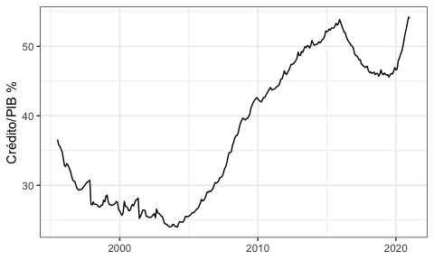
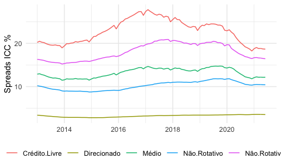

--- 
date: 2020
author: "Jackson da Silva Torres"
documentclass: 04-class-files/abntex2
classoption: [12pt, openright, oneside, a4paper, chapter=TITLE, section=TITLE, subsection=Title, english, french, spanish, portugues, sumario=tradicional]
header-includes:
- \input{00-input/00-dados}
- \input{09-packages/00-pacotes}
- \makeindex
- \usepackage{helvet}
- \renewcommand{\familydefault}{\sfdefault}
- \DeclareUnicodeCharacter{0301}{******}
- \DeclareUnicodeCharacter{0303}{******}
- \DeclareUnicodeCharacter{0327}{******}
spacing: OnehalfSpacing
site: bookdown::bookdown_site
bibliography: '10-references/referencias.bib'
biblio-style: abnt
link-citations: yes
toc: false
references: false
always_allow_html: TRUE
---

<!--chapter:end:index.Rmd-->

 \ifthenelse{\equal{\terCapa}{Sim}}{
\imprimircapa}{}

\ifthenelse{\equal{\terFolhaRosto}{Sim}}{
\imprimirfolhaderosto*}{}

 \ifthenelse{\equal{\terFichaCatalografica}{Sim}}
 {\insereFichaCatalografica{}\cleardoublepage}
 {}

 \ifthenelse{\equal{\terErrata}{Sim}}
 {\begin{errata}%\color{blue}
   \imprimirerrata
  \end{errata}}
 {}

\ifthenelse{\equal{\terTermoAprovacao}{Sim}}{
\insereAprovacao}{}

\ifthenelse{\equal{\terDedicatoria}{Sim}}{
\begin{dedicatoria}
   \vspace*{\fill}
   \centering
   \noindent
   \DedicatoriaTexto
   \vspace*{\fill}
\end{dedicatoria}
}{}

 \ifthenelse{\equal{\terAgradecimentos}{Sim}}
 {\begin{agradecimentos}
    \AgradecimentosTexto
  \end{agradecimentos}
  }{}

\ifthenelse{\equal{\terEpigrafe}{Sim}}{
\begin{epigrafe}
    \vspace*{\fill}
	\begin{flushright}
        \EpigrafeTexto
	\end{flushright}
\end{epigrafe}
}{}

 \ifthenelse{\equal{\terResumos}{Sim}}{
\begin{resumo}
    \ResumoTexto
    

   \noindent 
   \textbf{Palavras-chaves}: \PalavraschaveTexto
\end{resumo}

\begin{resumo}[ABSTRACT]
 \begin{otherlanguage*}{english}
   \AbstractTexto
   
   \noindent 
   \textbf{Key-words}: \KeywordsTexto
 \end{otherlanguage*}
\end{resumo}

\ifthenelse{\equal{\Resume}{}}
{}
{
 \begin{resumo}[RESUME]%Résumé
  \begin{otherlanguage*}{french}
     \Resume
     
   \noindent      
    \textbf{Mots clés}: \Motscles
  \end{otherlanguage*}
 \end{resumo}
} 

\ifthenelse{\equal{\Resume}{}}{}
{ \begin{resumo}[RESUMEN]
  \begin{otherlanguage*}{spanish}
    \Resumen 
   
   \noindent    
    \textbf{Palabras clave}: \Palabrasclave
  \end{otherlanguage*}
 \end{resumo}
}
}{}

\ifthenelse{\equal{\terListaFiguras}{Sim}}{
\pdfbookmark[0]{\listfigurename}{lof}
\listoffigures*
\cleardoublepage
}{}

\ifthenelse{\equal{\terListaTabelas}{Sim}}{
\listoftables*
\cleardoublepage
}{}

 \ifthenelse{\equal{\terSiglasAbrev}{Sim}}{
    \imprimirlistadesiglas
    \cleardoublepage
    \imprimirlistadesimbolos
    \cleardoublepage
 }{}

\ifthenelse{\equal{\terSumario}{Sim}}{
\tableofcontents*
}{}
 

 
 

<!--chapter:end:00-pretext.Rmd-->

\textual

\pagestyle{simple}

\chapter{INTRODUÇÃO}

---
Foi verificado o panorama das publicações de pesquisas relacionadas ao setor bancário no brasil, nos últimos 20 anos através da plataforma Capes, entre os anos 2000 e 2020. Foram utilizados os termos: Setor Bancário, Indústria Bancária, Mercado Bancário, Estrutura Bancária e Brasil\footnote{Foram utilizados operadores booleanos em inglês: banking(structure or market or sector or industry) and brazil*.}, revisados por pares, remontando um total de 4.512 publicações, demonstrando a relevância do tema.
---

<!--chapter:end:01-intro.Rmd-->

\part{REFERÊNCIAS TEÓRICOS}

\textual
\pagestyle{simple}

\chapter{Setor Bancário no Brasil}

Nesse capítulo serão abordados os conceitos, características, composição e
evolução do setor bancário brasileiro com objetivo de identificar variáveis
quantitativas e qualitativas relevantes para as analises dos componentes do
*spread* bancário. 

O setor bancário brasileiro é componente do Sistema Financeiro Nacional — SFN,
sob hierarquia normativa do Conselho Monetário Nacional - CMN e supervisão do
Banco Central do Brasil — BACEN. As instituições que formam o setor bancário
assumem o papel de operadoras no mercado de crédito, atuando como
intermediadoras financeiras junto as pessoas físicas e jurídicas, podendo ser 
de caráter público ou privado \cite{Lei:4595:1964}.

As modalidades de instituições no setor bancário brasileiro são os Bancos
Comerciais, Bancos de Investimentos, Bancos de Desenvolvimento, Bancos de
Câmbio, Bancos Múltiplos e Caixas Econômicas\footnote{Atualmente nessa
modalidade somente a Caixa Econômica Federal está em funcionamento} \cite{Lei:4595:1964}.

Os bancos comerciais se configuram por instituições financeiras de caráter
público ou privado constituídas na forma de sociedade anônima\footnote{Deve
constar em sua razão social a expressão Banco}, atuando na intermediação de
recursos financeiros de curto e médio prazo para financiamento de atividades
comerciais, industriais, serviços, pessoas físicas e terceiros, relizando
através de captações de depósitos à vista, de livre movimento, e depósitos à
prazo \cite{Res:2099:1994}.

A modalidade de Bancos de Investimento se caracterizam por instituições
financeiras privadas, na forma de sociedade anônima\footnote{Deve constar em
sua razão social a expressão Banco de Investimento, e não podem manter contas
correntes}, operando participações temporárias em sociedades, financiamentos
produtivos para ativo fixo e capital de giro e gestão de recursos de terceiros.
Realizam captação de recursos por meio de depósitos a prazo, repasses externos
e internos e comercialização de cotas de fundos de investimentos que
administram \cite{Res:2624:1999}.

Na categoria de Bancos de Desenvolvimento, são autorizadas instituições financeiras de caráter público, controladas por governos estaduais, com foco em financiamento de atividades que promovam o desenvolvimento econômico regional no médio e longo prazo, realizando operações passivas de depósitos a prazo, recursos externos, endossos hipotecários e operações ativas de empréstimos e financiamentos ao setor privado \cite{Res:394:1976}. 

Os Bancos Múltiplos se caracterizam por instituições financeira de caráter público ou privado, são autorizadas a realizar operações ativas e passivas por meio de acumulação das carteiras comercial, investimento, desenvolvimento\footnote{Somente os Bancos Públicos podem acumular a carteira de desenvolvimento}, crédito imobiliário, arrendamento mercantil e crédito, financiamento e investimento. Deve ser composto de no mínimo duas carteiras, e de forma obrigatória, uma delas deve ser comercial ou investimento, e as que possuem carteira comercial podem realizar captação via depósito à vista \cite{Res:2099:1994}.

No segmento de Bancos de Câmbio, as instituições financeiras possuem autorização para realizar operações compra e venda de crédito cambial. Entre as operações de crédito estão o financiamento para exportadores e importadores e antecipação mediante contratos cambiais. Podem receber depósitos em contas com movimentação restrita e sem remuneração exclusiva para as operações cambiais \cite{Res:3426:2006}.

A Caixa Econômica Federal — CEF, fundada em 1861, e regulamentada pelo Decreto-Lei nº 759 de 1969. Trata-se de uma empresa pública subordinada ao Ministério da Economia, com operações similares a de um Banco Comercial, priorizando projetos e programas relacionados a área social e infraestrutura \cite{DL:759:1969}. 

A CEF atua com operações de crédito direto ao consumidor, voltados para financiamento para bens de consumo duráveis, operações de garantia de penhor industrial e caução de títulos, e detém o monopólio sobre o penhor de bens pessoais e venda de bilhetes de loteria. É integrante do Sistema Financeiro da Habitação - SFH e Sistema Brasileiro de Poupança e Empréstimo - SBPE, além da detenção centralizado do recolhimento e aplicação dos recursos do FGTS \cite{DL:759:1969}.

O setor bancário brasileiro passou por significativas modificações em sua estrutura no final da década de 1980 e ao longo da década de 1990. Em \textcite{camargo:2009} é exposto que estas modificações ocorreram em grande parte como reflexo às mudanças internacionais e o processo de abertura comercial e financeira que se iniciou no Brasil. 

Na tabela abaixo é possível verificar a concentração do setor bancário brasileiro na categoria de bancos múltiplos, com 76%,3 de participação, onde apenas 11,5% das instituições bancárias operam exclusivamente com carteira comercial, 6,3% com investimento.

\begin{table}
\caption{Composição do setor bancário brasileiro por segmento em dezembro de 2019}
<table class="table" style="font-size: 10px; margin-left: auto; margin-right: auto;">
 <thead>
  <tr>
   <th style="text-align:left;"> Segmento </th>
   <th style="text-align:left;"> Sigla </th>
   <th style="text-align:left;"> Ano </th>
   <th style="text-align:right;"> Quantidade </th>
   <th style="text-align:left;"> Participação </th>
  </tr>
 </thead>
<tbody>
  <tr>
   <td style="text-align:left;width: 6cm; "> Banco Múltiplo </td>
   <td style="text-align:left;"> BM </td>
   <td style="text-align:left;"> 2019 </td>
   <td style="text-align:right;"> 132 </td>
   <td style="text-align:left;"> 76.30% </td>
  </tr>
  <tr>
   <td style="text-align:left;width: 6cm; "> Banco Comercial </td>
   <td style="text-align:left;"> BC </td>
   <td style="text-align:left;"> 2019 </td>
   <td style="text-align:right;"> 20 </td>
   <td style="text-align:left;"> 11.56% </td>
  </tr>
  <tr>
   <td style="text-align:left;width: 6cm; "> Banco de Investimento </td>
   <td style="text-align:left;"> BI </td>
   <td style="text-align:left;"> 2019 </td>
   <td style="text-align:right;"> 11 </td>
   <td style="text-align:left;"> 6.36% </td>
  </tr>
  <tr>
   <td style="text-align:left;width: 6cm; "> Banco de Câmbio </td>
   <td style="text-align:left;"> B Camb </td>
   <td style="text-align:left;"> 2019 </td>
   <td style="text-align:right;"> 5 </td>
   <td style="text-align:left;"> 2.89% </td>
  </tr>
  <tr>
   <td style="text-align:left;width: 6cm; "> Banco de Desenvolvimento </td>
   <td style="text-align:left;"> BD </td>
   <td style="text-align:left;"> 2019 </td>
   <td style="text-align:right;"> 4 </td>
   <td style="text-align:left;"> 2.31% </td>
  </tr>
  <tr>
   <td style="text-align:left;width: 6cm; "> Caixas Econômicas </td>
   <td style="text-align:left;"> CE </td>
   <td style="text-align:left;"> 2019 </td>
   <td style="text-align:right;"> 1 </td>
   <td style="text-align:left;"> 0.58% </td>
  </tr>
</tbody>
</table>
\label{tab:banks}
\fonte{Desenvolvido pelo autor com dados do Banco Central}
\end{table}

Entre as principais mudanças iniciadas na década de 1980 está a reforma bancária ocorrida em 1998, através da Resolução 1.524 \cite{Res:1524:1988}, que instituiu diversas medidas de desregulamentação, entre elas a extinção da necessidade de carta-patente para constituição de Bancos Múltiplos. Mesmo com limitações da Constituição de 1988 \cite{constituicao:1988} para instalação de bancos estrangeiros, não houveram restrições para que ocorresse aumento na participação de capital estrangeiro em bancos nacionais. 

\newpage
\captionof{figure}{Evolução do setor bancário brasileiro por segmento}

\label{fig:segmento}
\fonte{Desenvolvido pelo autor com dados do Banco Central}

O gráfico acima demonstra a evolução quantidade de instituições bancárias por segmento entre 1978 à 2019, podendo ser visualizada uma mudança na composição da estrutura, com significativos, aumento de instituições aderindo modalidades de múltiplas carteiras\footnote{As primeiras instituições com carteira múltipla começaram a operar no ano de 1988}, e redução de instituições que operavam exclusivamente com carteira comercial, e exclusivamente com carteira de investimento.

\begin{table}
\caption{Composição por tipo de iniciativa no setor bancário brasileiro — Dezembro 2019 }
<table class="table" style="font-size: 10px; margin-left: auto; margin-right: auto;">
 <thead>
  <tr>
   <th style="text-align:left;"> Tipo </th>
   <th style="text-align:left;"> Participação </th>
  </tr>
 </thead>
<tbody>
  <tr>
   <td style="text-align:left;width: 8cm; "> Privado </td>
   <td style="text-align:left;width: 8cm; "> 93% </td>
  </tr>
  <tr>
   <td style="text-align:left;width: 8cm; "> Público </td>
   <td style="text-align:left;width: 8cm; "> 7% </td>
  </tr>
</tbody>
</table>
\label{tab:iniciativa}
\fonte{Desenvolvido pelo autor com dados do Banco Central}
\end{table}

Alguns dos efeitos da abertura comercial e financeira e das modificações na estrutura bancária provenientes das medidas governamentais foram o aumento da participação de instituições estrangeiras no país, e um consistente processo de fusões e aquisições, de ambas as origens de capital, que resultou em considerável elevação do grau de concentração \cite{camargo:2009}.

\captionof{figure}{Evolução da quantidade de instituições no setor bancário brasileiro}

\label{fig:concentracao}
\fonte{Desenvolvido pelo autor com dados do Banco Central}

A observação sobre o aumento da concentração bancária no Brasil realizada por \textcite{camargo:2009} pode ser visualizada no gráfico acima. Entre as metades das décadas de 1980 e 1990 — onde ocorreu o processo de abertura — se visualizou uma redução da concentração, levando em consideração o número de instituições. Esse cenário passou se inverter a partir de 1994, chegando em 2019 a um nível aproximado ao observado no início da década de 1980.

De acordo com Strachman e Vasconcelos *apud* \textcite{camargo:2009}, o aumento da concentração bancária pode ser prejudicial ao crescimento econômico, uma vez que, com maior participação de mercado, as instituições bancárias acabam por obter a prerrogativa de determinar seus preços, comportamento este observado em \textcite{klein:1971}. 

Segundo \textcite{camargo:2009} por outra perspectiva, o ganho de escala, com redução de custos operacionais atua melhorando a remuneração dos depósitos podendo atuar na redução dos juros finais pagos pelos clientes.

Outra possível tendência para a concentração bancária é a redução do risco das operações, implicando em redução de custos, obtida por meio expansão geográfica, setorial e de produtos financeiros. Porém os possíveis efeitos da concentração dependem de uma série de condições, principalmente em torno da eficiência e do nível de concorrência no mercado \cite{camargo:2009}.

\begin{table}
\caption{Setor bancário brasileiro por origem de capital — Dezembro de 2019}
<table class="table" style="font-size: 10px; margin-left: auto; margin-right: auto;">
 <thead>
  <tr>
   <th style="text-align:left;"> Capital </th>
   <th style="text-align:right;"> Quantidade </th>
   <th style="text-align:left;"> Participação </th>
  </tr>
 </thead>
<tbody>
  <tr>
   <td style="text-align:left;"> Nacionais </td>
   <td style="text-align:right;"> 66 </td>
   <td style="text-align:left;"> 43.1% </td>
  </tr>
  <tr>
   <td style="text-align:left;"> Controle Estrangeiro </td>
   <td style="text-align:right;"> 60 </td>
   <td style="text-align:left;"> 39.2% </td>
  </tr>
  <tr>
   <td style="text-align:left;"> Nacionais com Participação Estrangeira </td>
   <td style="text-align:right;"> 12 </td>
   <td style="text-align:left;"> 7.8% </td>
  </tr>
  <tr>
   <td style="text-align:left;"> Públicos </td>
   <td style="text-align:right;"> 10 </td>
   <td style="text-align:left;"> 6.5% </td>
  </tr>
  <tr>
   <td style="text-align:left;"> Estrangeiros </td>
   <td style="text-align:right;"> 5 </td>
   <td style="text-align:left;"> 3.3% </td>
  </tr>
</tbody>
</table>
\label{tab:origemcapital}
\fonte{Desenvolvida pelo autor com dados do Banco Central}
\end{table}

\captionof{figure}{Evolução de origem de capital das instituições bancárias no Brasil}

\label{fig: ev.capital}
\fonte{Desenvolvido pelo autor com dados do Banco Central}

O aumento da participação estrangeira no setor bancário brasileiro durante a década de 1990, evidenciado por \textcite{camargo:2009} pode ser observado no gráfico acima. Esse aumento ocorreu principalmente através do controle acionário, com elevação acentuada na segunda metade da década de 1990 até o início da década de 2000. Ocorrendo redução em instituições 100% nacionais e estrangeiras e nacionais com participação estrangeira.  

Durante este período, a inclinação para aplicação massiva em títulos públicas se dava diante a manutenção de elevadas taxas de juros, tornando o crédito para empreendimentos privados de elevado risco, e consequentemente elevando substancialmente o *spread* bancário e reduzindo a oferta de crédito \cite{camargo:2009}.

A expectativa com a entrada de instituições estrangeiras era que houvesse elevação da concorrência e, consequentemente, redução no *spread* bancário, aumento da concessão de crédito, melhoria da qualidade e diversificação do produtos financeiros, avanços em tecnologias, ou seja, uma elevação na eficiência do setor \cite{camargo:2009}. 

Porém, o que se observou, de acordo com \textcite{camargo:2009}, foi a adoção de postura conservadora por partes dos bancos estrangeiros, com estratégia de ativos inclinada para negociação de títulos públicos, e passivos direcionados para a captação de recursos advindos de grupos de rendas média e alta, com exceção dos bancos públicos que concentraram em operações de crédito. O que levou a relação crédito/PIB ficar em níveis baixos comparados a outros países \cite{camargo:2009, leal:2006}.

Segundo Singh *apud* \textcite{leal:2006}, durante a década de 1990 o *spread* bancário no Brasil esteve superior a 50%a.a., enquanto na América Latina esteve entre 10% a 15% a.a, e a relação crédito/PIB em 2003 no Brasil era de 23%, muito abaixo de níveis considerados ótimos como: Chile com 68,5%, Uruguai com 64,3%, Estados Unidos com 60,8%, Japão com 64,3%, Coréia com 98,9% e Europa com 140,6%.

Durante o período citado, foi observado no setor bancário brasileiro os maiores níveis de *spread* praticados no mundo, associado a um quadro econômico instabilidades e baixo crescimento e desenvolvimento. Esse cenário encontra embasamento em estudos teóricos e empíricos que demonstram que um sistema financeiro desenvolvido favorece o crescimento e desenvolvimento econômico \cite{levine:1997, matos:2003}.

\captionof{figure}{Evolução da relação Crédito/PIB no Brasil}

\label{fig:credgdp}
\fonte{Desenvolvido pelo autor com dados o Banco Central}

O gráfico acima demonstra o comportamento da relação crédito/PIB no Brasil, que entre a segunda metade da década de 1990 até a meados da primeira metade da década de 2000 sofreu significativa queda, ficando abaixo dos 25%. Após esse período a oferta de crédito sofreu uma expansão exponencial atingindo patamares acima de 50% do PIB. 

\captionof{figure}{Evolução do \emph{spread} bancário brasileiro até 2011}

\label{fig:spread2012}
\fonte{Desenvolvido pelo autor com dados do Banco Central}

O gráfico acima mostra a evolução do *spread* bancário brasileiro médio entre os anos de 1994 e 2012, saindo de patamares que chegaram próximo a 150%, com significativa queda ao longo desse período, atingindo a casa de 25% no final. Abaixo o gráfico visualiza a evolução do *spread* médio entre 2012 e 2019, com nova metodologia de cálculo, chegando a ficar abaixo de 10%, não ultrapassando a casa dos 23% e terminando o período abaixo dos 18%.

<table>
 <thead>
  <tr>
   <th style="text-align:left;"> Data </th>
   <th style="text-align:left;"> Tipo </th>
   <th style="text-align:right;"> Valor </th>
  </tr>
 </thead>
<tbody>
  <tr>
   <td style="text-align:left;"> 2013-01-01 </td>
   <td style="text-align:left;"> Spread.MOC </td>
   <td style="text-align:right;"> 14.47 </td>
  </tr>
  <tr>
   <td style="text-align:left;"> 2013-02-01 </td>
   <td style="text-align:left;"> Spread.MOC </td>
   <td style="text-align:right;"> 14.59 </td>
  </tr>
  <tr>
   <td style="text-align:left;"> 2013-03-01 </td>
   <td style="text-align:left;"> Spread.MOC </td>
   <td style="text-align:right;"> 14.21 </td>
  </tr>
  <tr>
   <td style="text-align:left;"> 2013-04-01 </td>
   <td style="text-align:left;"> Spread.MOC </td>
   <td style="text-align:right;"> 14.11 </td>
  </tr>
  <tr>
   <td style="text-align:left;"> 2013-05-01 </td>
   <td style="text-align:left;"> Spread.MOC </td>
   <td style="text-align:right;"> 13.78 </td>
  </tr>
  <tr>
   <td style="text-align:left;"> 2013-06-01 </td>
   <td style="text-align:left;"> Spread.MOC </td>
   <td style="text-align:right;"> 13.34 </td>
  </tr>
  <tr>
   <td style="text-align:left;"> 2013-07-01 </td>
   <td style="text-align:left;"> Spread.MOC </td>
   <td style="text-align:right;"> 13.69 </td>
  </tr>
  <tr>
   <td style="text-align:left;"> 2013-08-01 </td>
   <td style="text-align:left;"> Spread.MOC </td>
   <td style="text-align:right;"> 13.55 </td>
  </tr>
  <tr>
   <td style="text-align:left;"> 2013-09-01 </td>
   <td style="text-align:left;"> Spread.MOC </td>
   <td style="text-align:right;"> 13.53 </td>
  </tr>
  <tr>
   <td style="text-align:left;"> 2013-10-01 </td>
   <td style="text-align:left;"> Spread.MOC </td>
   <td style="text-align:right;"> 13.79 </td>
  </tr>
  <tr>
   <td style="text-align:left;"> 2013-11-01 </td>
   <td style="text-align:left;"> Spread.MOC </td>
   <td style="text-align:right;"> 13.74 </td>
  </tr>
  <tr>
   <td style="text-align:left;"> 2013-12-01 </td>
   <td style="text-align:left;"> Spread.MOC </td>
   <td style="text-align:right;"> 13.28 </td>
  </tr>
  <tr>
   <td style="text-align:left;"> 2014-01-01 </td>
   <td style="text-align:left;"> Spread.MOC </td>
   <td style="text-align:right;"> 13.99 </td>
  </tr>
  <tr>
   <td style="text-align:left;"> 2014-02-01 </td>
   <td style="text-align:left;"> Spread.MOC </td>
   <td style="text-align:right;"> 14.75 </td>
  </tr>
  <tr>
   <td style="text-align:left;"> 2014-03-01 </td>
   <td style="text-align:left;"> Spread.MOC </td>
   <td style="text-align:right;"> 14.72 </td>
  </tr>
  <tr>
   <td style="text-align:left;"> 2014-04-01 </td>
   <td style="text-align:left;"> Spread.MOC </td>
   <td style="text-align:right;"> 14.81 </td>
  </tr>
  <tr>
   <td style="text-align:left;"> 2014-05-01 </td>
   <td style="text-align:left;"> Spread.MOC </td>
   <td style="text-align:right;"> 14.95 </td>
  </tr>
  <tr>
   <td style="text-align:left;"> 2014-06-01 </td>
   <td style="text-align:left;"> Spread.MOC </td>
   <td style="text-align:right;"> 15.02 </td>
  </tr>
  <tr>
   <td style="text-align:left;"> 2014-07-01 </td>
   <td style="text-align:left;"> Spread.MOC </td>
   <td style="text-align:right;"> 15.30 </td>
  </tr>
  <tr>
   <td style="text-align:left;"> 2014-08-01 </td>
   <td style="text-align:left;"> Spread.MOC </td>
   <td style="text-align:right;"> 15.18 </td>
  </tr>
  <tr>
   <td style="text-align:left;"> 2014-09-01 </td>
   <td style="text-align:left;"> Spread.MOC </td>
   <td style="text-align:right;"> 14.84 </td>
  </tr>
  <tr>
   <td style="text-align:left;"> 2014-10-01 </td>
   <td style="text-align:left;"> Spread.MOC </td>
   <td style="text-align:right;"> 15.18 </td>
  </tr>
  <tr>
   <td style="text-align:left;"> 2014-11-01 </td>
   <td style="text-align:left;"> Spread.MOC </td>
   <td style="text-align:right;"> 15.12 </td>
  </tr>
  <tr>
   <td style="text-align:left;"> 2014-12-01 </td>
   <td style="text-align:left;"> Spread.MOC </td>
   <td style="text-align:right;"> 14.61 </td>
  </tr>
  <tr>
   <td style="text-align:left;"> 2015-01-01 </td>
   <td style="text-align:left;"> Spread.MOC </td>
   <td style="text-align:right;"> 15.68 </td>
  </tr>
  <tr>
   <td style="text-align:left;"> 2015-02-01 </td>
   <td style="text-align:left;"> Spread.MOC </td>
   <td style="text-align:right;"> 16.28 </td>
  </tr>
  <tr>
   <td style="text-align:left;"> 2015-03-01 </td>
   <td style="text-align:left;"> Spread.MOC </td>
   <td style="text-align:right;"> 16.03 </td>
  </tr>
  <tr>
   <td style="text-align:left;"> 2015-04-01 </td>
   <td style="text-align:left;"> Spread.MOC </td>
   <td style="text-align:right;"> 16.75 </td>
  </tr>
  <tr>
   <td style="text-align:left;"> 2015-05-01 </td>
   <td style="text-align:left;"> Spread.MOC </td>
   <td style="text-align:right;"> 17.05 </td>
  </tr>
  <tr>
   <td style="text-align:left;"> 2015-06-01 </td>
   <td style="text-align:left;"> Spread.MOC </td>
   <td style="text-align:right;"> 17.44 </td>
  </tr>
  <tr>
   <td style="text-align:left;"> 2015-07-01 </td>
   <td style="text-align:left;"> Spread.MOC </td>
   <td style="text-align:right;"> 18.06 </td>
  </tr>
  <tr>
   <td style="text-align:left;"> 2015-08-01 </td>
   <td style="text-align:left;"> Spread.MOC </td>
   <td style="text-align:right;"> 18.32 </td>
  </tr>
  <tr>
   <td style="text-align:left;"> 2015-09-01 </td>
   <td style="text-align:left;"> Spread.MOC </td>
   <td style="text-align:right;"> 18.21 </td>
  </tr>
  <tr>
   <td style="text-align:left;"> 2015-10-01 </td>
   <td style="text-align:left;"> Spread.MOC </td>
   <td style="text-align:right;"> 18.83 </td>
  </tr>
  <tr>
   <td style="text-align:left;"> 2015-11-01 </td>
   <td style="text-align:left;"> Spread.MOC </td>
   <td style="text-align:right;"> 19.09 </td>
  </tr>
  <tr>
   <td style="text-align:left;"> 2015-12-01 </td>
   <td style="text-align:left;"> Spread.MOC </td>
   <td style="text-align:right;"> 18.21 </td>
  </tr>
  <tr>
   <td style="text-align:left;"> 2016-01-01 </td>
   <td style="text-align:left;"> Spread.MOC </td>
   <td style="text-align:right;"> 19.78 </td>
  </tr>
  <tr>
   <td style="text-align:left;"> 2016-02-01 </td>
   <td style="text-align:left;"> Spread.MOC </td>
   <td style="text-align:right;"> 20.56 </td>
  </tr>
  <tr>
   <td style="text-align:left;"> 2016-03-01 </td>
   <td style="text-align:left;"> Spread.MOC </td>
   <td style="text-align:right;"> 21.28 </td>
  </tr>
  <tr>
   <td style="text-align:left;"> 2016-04-01 </td>
   <td style="text-align:left;"> Spread.MOC </td>
   <td style="text-align:right;"> 21.99 </td>
  </tr>
  <tr>
   <td style="text-align:left;"> 2016-05-01 </td>
   <td style="text-align:left;"> Spread.MOC </td>
   <td style="text-align:right;"> 22.32 </td>
  </tr>
  <tr>
   <td style="text-align:left;"> 2016-06-01 </td>
   <td style="text-align:left;"> Spread.MOC </td>
   <td style="text-align:right;"> 22.17 </td>
  </tr>
  <tr>
   <td style="text-align:left;"> 2016-07-01 </td>
   <td style="text-align:left;"> Spread.MOC </td>
   <td style="text-align:right;"> 22.68 </td>
  </tr>
  <tr>
   <td style="text-align:left;"> 2016-08-01 </td>
   <td style="text-align:left;"> Spread.MOC </td>
   <td style="text-align:right;"> 22.93 </td>
  </tr>
  <tr>
   <td style="text-align:left;"> 2016-09-01 </td>
   <td style="text-align:left;"> Spread.MOC </td>
   <td style="text-align:right;"> 23.12 </td>
  </tr>
  <tr>
   <td style="text-align:left;"> 2016-10-01 </td>
   <td style="text-align:left;"> Spread.MOC </td>
   <td style="text-align:right;"> 23.61 </td>
  </tr>
  <tr>
   <td style="text-align:left;"> 2016-11-01 </td>
   <td style="text-align:left;"> Spread.MOC </td>
   <td style="text-align:right;"> 23.23 </td>
  </tr>
  <tr>
   <td style="text-align:left;"> 2016-12-01 </td>
   <td style="text-align:left;"> Spread.MOC </td>
   <td style="text-align:right;"> 22.31 </td>
  </tr>
  <tr>
   <td style="text-align:left;"> 2017-01-01 </td>
   <td style="text-align:left;"> Spread.MOC </td>
   <td style="text-align:right;"> 23.59 </td>
  </tr>
  <tr>
   <td style="text-align:left;"> 2017-02-01 </td>
   <td style="text-align:left;"> Spread.MOC </td>
   <td style="text-align:right;"> 23.55 </td>
  </tr>
  <tr>
   <td style="text-align:left;"> 2017-03-01 </td>
   <td style="text-align:left;"> Spread.MOC </td>
   <td style="text-align:right;"> 23.50 </td>
  </tr>
  <tr>
   <td style="text-align:left;"> 2017-04-01 </td>
   <td style="text-align:left;"> Spread.MOC </td>
   <td style="text-align:right;"> 21.91 </td>
  </tr>
  <tr>
   <td style="text-align:left;"> 2017-05-01 </td>
   <td style="text-align:left;"> Spread.MOC </td>
   <td style="text-align:right;"> 21.11 </td>
  </tr>
  <tr>
   <td style="text-align:left;"> 2017-06-01 </td>
   <td style="text-align:left;"> Spread.MOC </td>
   <td style="text-align:right;"> 20.57 </td>
  </tr>
  <tr>
   <td style="text-align:left;"> 2017-07-01 </td>
   <td style="text-align:left;"> Spread.MOC </td>
   <td style="text-align:right;"> 20.97 </td>
  </tr>
  <tr>
   <td style="text-align:left;"> 2017-08-01 </td>
   <td style="text-align:left;"> Spread.MOC </td>
   <td style="text-align:right;"> 20.80 </td>
  </tr>
  <tr>
   <td style="text-align:left;"> 2017-09-01 </td>
   <td style="text-align:left;"> Spread.MOC </td>
   <td style="text-align:right;"> 19.71 </td>
  </tr>
  <tr>
   <td style="text-align:left;"> 2017-10-01 </td>
   <td style="text-align:left;"> Spread.MOC </td>
   <td style="text-align:right;"> 20.27 </td>
  </tr>
  <tr>
   <td style="text-align:left;"> 2017-11-01 </td>
   <td style="text-align:left;"> Spread.MOC </td>
   <td style="text-align:right;"> 19.65 </td>
  </tr>
  <tr>
   <td style="text-align:left;"> 2017-12-01 </td>
   <td style="text-align:left;"> Spread.MOC </td>
   <td style="text-align:right;"> 18.47 </td>
  </tr>
  <tr>
   <td style="text-align:left;"> 2018-01-01 </td>
   <td style="text-align:left;"> Spread.MOC </td>
   <td style="text-align:right;"> 19.28 </td>
  </tr>
  <tr>
   <td style="text-align:left;"> 2018-02-01 </td>
   <td style="text-align:left;"> Spread.MOC </td>
   <td style="text-align:right;"> 19.90 </td>
  </tr>
  <tr>
   <td style="text-align:left;"> 2018-03-01 </td>
   <td style="text-align:left;"> Spread.MOC </td>
   <td style="text-align:right;"> 19.47 </td>
  </tr>
  <tr>
   <td style="text-align:left;"> 2018-04-01 </td>
   <td style="text-align:left;"> Spread.MOC </td>
   <td style="text-align:right;"> 19.12 </td>
  </tr>
  <tr>
   <td style="text-align:left;"> 2018-05-01 </td>
   <td style="text-align:left;"> Spread.MOC </td>
   <td style="text-align:right;"> 18.03 </td>
  </tr>
  <tr>
   <td style="text-align:left;"> 2018-06-01 </td>
   <td style="text-align:left;"> Spread.MOC </td>
   <td style="text-align:right;"> 17.24 </td>
  </tr>
  <tr>
   <td style="text-align:left;"> 2018-07-01 </td>
   <td style="text-align:left;"> Spread.MOC </td>
   <td style="text-align:right;"> 17.28 </td>
  </tr>
  <tr>
   <td style="text-align:left;"> 2018-08-01 </td>
   <td style="text-align:left;"> Spread.MOC </td>
   <td style="text-align:right;"> 17.02 </td>
  </tr>
  <tr>
   <td style="text-align:left;"> 2018-09-01 </td>
   <td style="text-align:left;"> Spread.MOC </td>
   <td style="text-align:right;"> 16.85 </td>
  </tr>
  <tr>
   <td style="text-align:left;"> 2018-10-01 </td>
   <td style="text-align:left;"> Spread.MOC </td>
   <td style="text-align:right;"> 17.50 </td>
  </tr>
  <tr>
   <td style="text-align:left;"> 2018-11-01 </td>
   <td style="text-align:left;"> Spread.MOC </td>
   <td style="text-align:right;"> 17.69 </td>
  </tr>
  <tr>
   <td style="text-align:left;"> 2018-12-01 </td>
   <td style="text-align:left;"> Spread.MOC </td>
   <td style="text-align:right;"> 16.54 </td>
  </tr>
  <tr>
   <td style="text-align:left;"> 2019-01-01 </td>
   <td style="text-align:left;"> Spread.MOC </td>
   <td style="text-align:right;"> 18.17 </td>
  </tr>
  <tr>
   <td style="text-align:left;"> 2019-02-01 </td>
   <td style="text-align:left;"> Spread.MOC </td>
   <td style="text-align:right;"> 18.57 </td>
  </tr>
  <tr>
   <td style="text-align:left;"> 2019-03-01 </td>
   <td style="text-align:left;"> Spread.MOC </td>
   <td style="text-align:right;"> 18.79 </td>
  </tr>
  <tr>
   <td style="text-align:left;"> 2019-04-01 </td>
   <td style="text-align:left;"> Spread.MOC </td>
   <td style="text-align:right;"> 18.88 </td>
  </tr>
  <tr>
   <td style="text-align:left;"> 2019-05-01 </td>
   <td style="text-align:left;"> Spread.MOC </td>
   <td style="text-align:right;"> 18.78 </td>
  </tr>
  <tr>
   <td style="text-align:left;"> 2019-06-01 </td>
   <td style="text-align:left;"> Spread.MOC </td>
   <td style="text-align:right;"> 19.07 </td>
  </tr>
  <tr>
   <td style="text-align:left;"> 2019-07-01 </td>
   <td style="text-align:left;"> Spread.MOC </td>
   <td style="text-align:right;"> 19.26 </td>
  </tr>
  <tr>
   <td style="text-align:left;"> 2019-08-01 </td>
   <td style="text-align:left;"> Spread.MOC </td>
   <td style="text-align:right;"> 19.42 </td>
  </tr>
  <tr>
   <td style="text-align:left;"> 2019-09-01 </td>
   <td style="text-align:left;"> Spread.MOC </td>
   <td style="text-align:right;"> 18.82 </td>
  </tr>
  <tr>
   <td style="text-align:left;"> 2019-10-01 </td>
   <td style="text-align:left;"> Spread.MOC </td>
   <td style="text-align:right;"> 18.71 </td>
  </tr>
  <tr>
   <td style="text-align:left;"> 2019-11-01 </td>
   <td style="text-align:left;"> Spread.MOC </td>
   <td style="text-align:right;"> 18.86 </td>
  </tr>
  <tr>
   <td style="text-align:left;"> 2019-12-01 </td>
   <td style="text-align:left;"> Spread.MOC </td>
   <td style="text-align:right;"> 17.86 </td>
  </tr>
</tbody>
</table>

<table>
 <thead>
  <tr>
   <th style="text-align:left;"> data </th>
   <th style="text-align:right;"> Saldo.Crédito </th>
  </tr>
 </thead>
<tbody>
  <tr>
   <td style="text-align:left;"> 01/01/1990 </td>
   <td style="text-align:right;"> 1 </td>
  </tr>
  <tr>
   <td style="text-align:left;"> 01/02/1990 </td>
   <td style="text-align:right;"> 1 </td>
  </tr>
  <tr>
   <td style="text-align:left;"> 01/03/1990 </td>
   <td style="text-align:right;"> 2 </td>
  </tr>
  <tr>
   <td style="text-align:left;"> 01/04/1990 </td>
   <td style="text-align:right;"> 2 </td>
  </tr>
  <tr>
   <td style="text-align:left;"> 01/05/1990 </td>
   <td style="text-align:right;"> 2 </td>
  </tr>
  <tr>
   <td style="text-align:left;"> 01/06/1990 </td>
   <td style="text-align:right;"> 3 </td>
  </tr>
  <tr>
   <td style="text-align:left;"> 01/07/1990 </td>
   <td style="text-align:right;"> 3 </td>
  </tr>
  <tr>
   <td style="text-align:left;"> 01/08/1990 </td>
   <td style="text-align:right;"> 3 </td>
  </tr>
  <tr>
   <td style="text-align:left;"> 01/09/1990 </td>
   <td style="text-align:right;"> 4 </td>
  </tr>
  <tr>
   <td style="text-align:left;"> 01/10/1990 </td>
   <td style="text-align:right;"> 4 </td>
  </tr>
  <tr>
   <td style="text-align:left;"> 01/11/1990 </td>
   <td style="text-align:right;"> 5 </td>
  </tr>
  <tr>
   <td style="text-align:left;"> 01/12/1990 </td>
   <td style="text-align:right;"> 6 </td>
  </tr>
  <tr>
   <td style="text-align:left;"> 01/01/1991 </td>
   <td style="text-align:right;"> 7 </td>
  </tr>
  <tr>
   <td style="text-align:left;"> 01/02/1991 </td>
   <td style="text-align:right;"> 8 </td>
  </tr>
  <tr>
   <td style="text-align:left;"> 01/03/1991 </td>
   <td style="text-align:right;"> 9 </td>
  </tr>
  <tr>
   <td style="text-align:left;"> 01/04/1991 </td>
   <td style="text-align:right;"> 10 </td>
  </tr>
  <tr>
   <td style="text-align:left;"> 01/05/1991 </td>
   <td style="text-align:right;"> 11 </td>
  </tr>
  <tr>
   <td style="text-align:left;"> 01/06/1991 </td>
   <td style="text-align:right;"> 12 </td>
  </tr>
  <tr>
   <td style="text-align:left;"> 01/07/1991 </td>
   <td style="text-align:right;"> 13 </td>
  </tr>
  <tr>
   <td style="text-align:left;"> 01/08/1991 </td>
   <td style="text-align:right;"> 15 </td>
  </tr>
  <tr>
   <td style="text-align:left;"> 01/09/1991 </td>
   <td style="text-align:right;"> 18 </td>
  </tr>
  <tr>
   <td style="text-align:left;"> 01/10/1991 </td>
   <td style="text-align:right;"> 22 </td>
  </tr>
  <tr>
   <td style="text-align:left;"> 01/11/1991 </td>
   <td style="text-align:right;"> 28 </td>
  </tr>
  <tr>
   <td style="text-align:left;"> 01/12/1991 </td>
   <td style="text-align:right;"> 35 </td>
  </tr>
  <tr>
   <td style="text-align:left;"> 01/01/1992 </td>
   <td style="text-align:right;"> 45 </td>
  </tr>
  <tr>
   <td style="text-align:left;"> 01/02/1992 </td>
   <td style="text-align:right;"> 56 </td>
  </tr>
  <tr>
   <td style="text-align:left;"> 01/03/1992 </td>
   <td style="text-align:right;"> 69 </td>
  </tr>
  <tr>
   <td style="text-align:left;"> 01/04/1992 </td>
   <td style="text-align:right;"> 84 </td>
  </tr>
  <tr>
   <td style="text-align:left;"> 01/05/1992 </td>
   <td style="text-align:right;"> 103 </td>
  </tr>
  <tr>
   <td style="text-align:left;"> 01/06/1992 </td>
   <td style="text-align:right;"> 131 </td>
  </tr>
  <tr>
   <td style="text-align:left;"> 01/07/1992 </td>
   <td style="text-align:right;"> 162 </td>
  </tr>
  <tr>
   <td style="text-align:left;"> 01/08/1992 </td>
   <td style="text-align:right;"> 202 </td>
  </tr>
  <tr>
   <td style="text-align:left;"> 01/09/1992 </td>
   <td style="text-align:right;"> 255 </td>
  </tr>
  <tr>
   <td style="text-align:left;"> 01/10/1992 </td>
   <td style="text-align:right;"> 322 </td>
  </tr>
  <tr>
   <td style="text-align:left;"> 01/11/1992 </td>
   <td style="text-align:right;"> 409 </td>
  </tr>
  <tr>
   <td style="text-align:left;"> 01/12/1992 </td>
   <td style="text-align:right;"> 523 </td>
  </tr>
  <tr>
   <td style="text-align:left;"> 01/01/1993 </td>
   <td style="text-align:right;"> 659 </td>
  </tr>
  <tr>
   <td style="text-align:left;"> 01/02/1993 </td>
   <td style="text-align:right;"> 843 </td>
  </tr>
  <tr>
   <td style="text-align:left;"> 01/03/1993 </td>
   <td style="text-align:right;"> 1067 </td>
  </tr>
  <tr>
   <td style="text-align:left;"> 01/04/1993 </td>
   <td style="text-align:right;"> 1386 </td>
  </tr>
  <tr>
   <td style="text-align:left;"> 01/05/1993 </td>
   <td style="text-align:right;"> 1838 </td>
  </tr>
  <tr>
   <td style="text-align:left;"> 01/06/1993 </td>
   <td style="text-align:right;"> 2411 </td>
  </tr>
  <tr>
   <td style="text-align:left;"> 01/07/1993 </td>
   <td style="text-align:right;"> 3215 </td>
  </tr>
  <tr>
   <td style="text-align:left;"> 01/08/1993 </td>
   <td style="text-align:right;"> 4348 </td>
  </tr>
  <tr>
   <td style="text-align:left;"> 01/09/1993 </td>
   <td style="text-align:right;"> 5907 </td>
  </tr>
  <tr>
   <td style="text-align:left;"> 01/10/1993 </td>
   <td style="text-align:right;"> 8288 </td>
  </tr>
  <tr>
   <td style="text-align:left;"> 01/11/1993 </td>
   <td style="text-align:right;"> 11427 </td>
  </tr>
  <tr>
   <td style="text-align:left;"> 01/12/1993 </td>
   <td style="text-align:right;"> 15789 </td>
  </tr>
  <tr>
   <td style="text-align:left;"> 01/01/1994 </td>
   <td style="text-align:right;"> 22015 </td>
  </tr>
  <tr>
   <td style="text-align:left;"> 01/02/1994 </td>
   <td style="text-align:right;"> 31619 </td>
  </tr>
  <tr>
   <td style="text-align:left;"> 01/03/1994 </td>
   <td style="text-align:right;"> 45129 </td>
  </tr>
  <tr>
   <td style="text-align:left;"> 01/04/1994 </td>
   <td style="text-align:right;"> 63896 </td>
  </tr>
  <tr>
   <td style="text-align:left;"> 01/05/1994 </td>
   <td style="text-align:right;"> 94895 </td>
  </tr>
  <tr>
   <td style="text-align:left;"> 01/06/1994 </td>
   <td style="text-align:right;"> 140753 </td>
  </tr>
  <tr>
   <td style="text-align:left;"> 01/07/1994 </td>
   <td style="text-align:right;"> 151410 </td>
  </tr>
  <tr>
   <td style="text-align:left;"> 01/08/1994 </td>
   <td style="text-align:right;"> 161528 </td>
  </tr>
  <tr>
   <td style="text-align:left;"> 01/09/1994 </td>
   <td style="text-align:right;"> 170178 </td>
  </tr>
  <tr>
   <td style="text-align:left;"> 01/10/1994 </td>
   <td style="text-align:right;"> 177727 </td>
  </tr>
  <tr>
   <td style="text-align:left;"> 01/11/1994 </td>
   <td style="text-align:right;"> 183928 </td>
  </tr>
  <tr>
   <td style="text-align:left;"> 01/12/1994 </td>
   <td style="text-align:right;"> 186856 </td>
  </tr>
  <tr>
   <td style="text-align:left;"> 01/01/1995 </td>
   <td style="text-align:right;"> 193123 </td>
  </tr>
  <tr>
   <td style="text-align:left;"> 01/02/1995 </td>
   <td style="text-align:right;"> 200569 </td>
  </tr>
  <tr>
   <td style="text-align:left;"> 01/03/1995 </td>
   <td style="text-align:right;"> 207983 </td>
  </tr>
  <tr>
   <td style="text-align:left;"> 01/04/1995 </td>
   <td style="text-align:right;"> 215147 </td>
  </tr>
  <tr>
   <td style="text-align:left;"> 01/05/1995 </td>
   <td style="text-align:right;"> 221882 </td>
  </tr>
  <tr>
   <td style="text-align:left;"> 01/06/1995 </td>
   <td style="text-align:right;"> 226148 </td>
  </tr>
  <tr>
   <td style="text-align:left;"> 01/07/1995 </td>
   <td style="text-align:right;"> 223165 </td>
  </tr>
  <tr>
   <td style="text-align:left;"> 01/08/1995 </td>
   <td style="text-align:right;"> 224534 </td>
  </tr>
  <tr>
   <td style="text-align:left;"> 01/09/1995 </td>
   <td style="text-align:right;"> 229352 </td>
  </tr>
  <tr>
   <td style="text-align:left;"> 01/10/1995 </td>
   <td style="text-align:right;"> 233029 </td>
  </tr>
  <tr>
   <td style="text-align:left;"> 01/11/1995 </td>
   <td style="text-align:right;"> 237909 </td>
  </tr>
  <tr>
   <td style="text-align:left;"> 01/12/1995 </td>
   <td style="text-align:right;"> 238644 </td>
  </tr>
  <tr>
   <td style="text-align:left;"> 01/01/1996 </td>
   <td style="text-align:right;"> 237355 </td>
  </tr>
  <tr>
   <td style="text-align:left;"> 01/02/1996 </td>
   <td style="text-align:right;"> 240545 </td>
  </tr>
  <tr>
   <td style="text-align:left;"> 01/03/1996 </td>
   <td style="text-align:right;"> 244550 </td>
  </tr>
  <tr>
   <td style="text-align:left;"> 01/04/1996 </td>
   <td style="text-align:right;"> 245389 </td>
  </tr>
  <tr>
   <td style="text-align:left;"> 01/05/1996 </td>
   <td style="text-align:right;"> 246296 </td>
  </tr>
  <tr>
   <td style="text-align:left;"> 01/06/1996 </td>
   <td style="text-align:right;"> 247998 </td>
  </tr>
  <tr>
   <td style="text-align:left;"> 01/07/1996 </td>
   <td style="text-align:right;"> 248124 </td>
  </tr>
  <tr>
   <td style="text-align:left;"> 01/08/1996 </td>
   <td style="text-align:right;"> 247309 </td>
  </tr>
  <tr>
   <td style="text-align:left;"> 01/09/1996 </td>
   <td style="text-align:right;"> 248882 </td>
  </tr>
  <tr>
   <td style="text-align:left;"> 01/10/1996 </td>
   <td style="text-align:right;"> 252646 </td>
  </tr>
  <tr>
   <td style="text-align:left;"> 01/11/1996 </td>
   <td style="text-align:right;"> 251760 </td>
  </tr>
  <tr>
   <td style="text-align:left;"> 01/12/1996 </td>
   <td style="text-align:right;"> 252507 </td>
  </tr>
  <tr>
   <td style="text-align:left;"> 01/01/1997 </td>
   <td style="text-align:right;"> 254729 </td>
  </tr>
  <tr>
   <td style="text-align:left;"> 01/02/1997 </td>
   <td style="text-align:right;"> 257380 </td>
  </tr>
  <tr>
   <td style="text-align:left;"> 01/03/1997 </td>
   <td style="text-align:right;"> 259971 </td>
  </tr>
  <tr>
   <td style="text-align:left;"> 01/04/1997 </td>
   <td style="text-align:right;"> 263138 </td>
  </tr>
  <tr>
   <td style="text-align:left;"> 01/05/1997 </td>
   <td style="text-align:right;"> 267567 </td>
  </tr>
  <tr>
   <td style="text-align:left;"> 01/06/1997 </td>
   <td style="text-align:right;"> 272685 </td>
  </tr>
  <tr>
   <td style="text-align:left;"> 01/07/1997 </td>
   <td style="text-align:right;"> 276711 </td>
  </tr>
  <tr>
   <td style="text-align:left;"> 01/08/1997 </td>
   <td style="text-align:right;"> 281114 </td>
  </tr>
  <tr>
   <td style="text-align:left;"> 01/09/1997 </td>
   <td style="text-align:right;"> 285783 </td>
  </tr>
  <tr>
   <td style="text-align:left;"> 01/10/1997 </td>
   <td style="text-align:right;"> 290084 </td>
  </tr>
  <tr>
   <td style="text-align:left;"> 01/11/1997 </td>
   <td style="text-align:right;"> 292603 </td>
  </tr>
  <tr>
   <td style="text-align:left;"> 01/12/1997 </td>
   <td style="text-align:right;"> 259689 </td>
  </tr>
  <tr>
   <td style="text-align:left;"> 01/01/1998 </td>
   <td style="text-align:right;"> 259247 </td>
  </tr>
  <tr>
   <td style="text-align:left;"> 01/02/1998 </td>
   <td style="text-align:right;"> 264561 </td>
  </tr>
  <tr>
   <td style="text-align:left;"> 01/03/1998 </td>
   <td style="text-align:right;"> 264251 </td>
  </tr>
  <tr>
   <td style="text-align:left;"> 01/04/1998 </td>
   <td style="text-align:right;"> 266188 </td>
  </tr>
  <tr>
   <td style="text-align:left;"> 01/05/1998 </td>
   <td style="text-align:right;"> 268014 </td>
  </tr>
  <tr>
   <td style="text-align:left;"> 01/06/1998 </td>
   <td style="text-align:right;"> 267094 </td>
  </tr>
  <tr>
   <td style="text-align:left;"> 01/07/1998 </td>
   <td style="text-align:right;"> 266781 </td>
  </tr>
  <tr>
   <td style="text-align:left;"> 01/08/1998 </td>
   <td style="text-align:right;"> 268189 </td>
  </tr>
  <tr>
   <td style="text-align:left;"> 01/09/1998 </td>
   <td style="text-align:right;"> 271290 </td>
  </tr>
  <tr>
   <td style="text-align:left;"> 01/10/1998 </td>
   <td style="text-align:right;"> 271372 </td>
  </tr>
  <tr>
   <td style="text-align:left;"> 01/11/1998 </td>
   <td style="text-align:right;"> 278754 </td>
  </tr>
  <tr>
   <td style="text-align:left;"> 01/12/1998 </td>
   <td style="text-align:right;"> 276888 </td>
  </tr>
  <tr>
   <td style="text-align:left;"> 01/01/1999 </td>
   <td style="text-align:right;"> 285572 </td>
  </tr>
  <tr>
   <td style="text-align:left;"> 01/02/1999 </td>
   <td style="text-align:right;"> 288519 </td>
  </tr>
  <tr>
   <td style="text-align:left;"> 01/03/1999 </td>
   <td style="text-align:right;"> 281128 </td>
  </tr>
  <tr>
   <td style="text-align:left;"> 01/04/1999 </td>
   <td style="text-align:right;"> 278607 </td>
  </tr>
  <tr>
   <td style="text-align:left;"> 01/05/1999 </td>
   <td style="text-align:right;"> 280168 </td>
  </tr>
  <tr>
   <td style="text-align:left;"> 01/06/1999 </td>
   <td style="text-align:right;"> 280154 </td>
  </tr>
  <tr>
   <td style="text-align:left;"> 01/07/1999 </td>
   <td style="text-align:right;"> 282091 </td>
  </tr>
  <tr>
   <td style="text-align:left;"> 01/08/1999 </td>
   <td style="text-align:right;"> 284365 </td>
  </tr>
  <tr>
   <td style="text-align:left;"> 01/09/1999 </td>
   <td style="text-align:right;"> 287791 </td>
  </tr>
  <tr>
   <td style="text-align:left;"> 01/10/1999 </td>
   <td style="text-align:right;"> 292800 </td>
  </tr>
  <tr>
   <td style="text-align:left;"> 01/11/1999 </td>
   <td style="text-align:right;"> 295824 </td>
  </tr>
  <tr>
   <td style="text-align:left;"> 01/12/1999 </td>
   <td style="text-align:right;"> 288505 </td>
  </tr>
  <tr>
   <td style="text-align:left;"> 01/01/2000 </td>
   <td style="text-align:right;"> 289197 </td>
  </tr>
  <tr>
   <td style="text-align:left;"> 01/02/2000 </td>
   <td style="text-align:right;"> 287573 </td>
  </tr>
  <tr>
   <td style="text-align:left;"> 01/03/2000 </td>
   <td style="text-align:right;"> 286084 </td>
  </tr>
  <tr>
   <td style="text-align:left;"> 01/04/2000 </td>
   <td style="text-align:right;"> 291609 </td>
  </tr>
  <tr>
   <td style="text-align:left;"> 01/05/2000 </td>
   <td style="text-align:right;"> 312232 </td>
  </tr>
  <tr>
   <td style="text-align:left;"> 01/06/2000 </td>
   <td style="text-align:right;"> 307011 </td>
  </tr>
  <tr>
   <td style="text-align:left;"> 01/07/2000 </td>
   <td style="text-align:right;"> 309905 </td>
  </tr>
  <tr>
   <td style="text-align:left;"> 01/08/2000 </td>
   <td style="text-align:right;"> 310257 </td>
  </tr>
  <tr>
   <td style="text-align:left;"> 01/09/2000 </td>
   <td style="text-align:right;"> 308673 </td>
  </tr>
  <tr>
   <td style="text-align:left;"> 01/10/2000 </td>
   <td style="text-align:right;"> 312895 </td>
  </tr>
  <tr>
   <td style="text-align:left;"> 01/11/2000 </td>
   <td style="text-align:right;"> 320782 </td>
  </tr>
  <tr>
   <td style="text-align:left;"> 01/12/2000 </td>
   <td style="text-align:right;"> 326826 </td>
  </tr>
  <tr>
   <td style="text-align:left;"> 01/01/2001 </td>
   <td style="text-align:right;"> 326686 </td>
  </tr>
  <tr>
   <td style="text-align:left;"> 01/02/2001 </td>
   <td style="text-align:right;"> 335278 </td>
  </tr>
  <tr>
   <td style="text-align:left;"> 01/03/2001 </td>
   <td style="text-align:right;"> 343913 </td>
  </tr>
  <tr>
   <td style="text-align:left;"> 01/04/2001 </td>
   <td style="text-align:right;"> 349563 </td>
  </tr>
  <tr>
   <td style="text-align:left;"> 01/05/2001 </td>
   <td style="text-align:right;"> 355931 </td>
  </tr>
  <tr>
   <td style="text-align:left;"> 01/06/2001 </td>
   <td style="text-align:right;"> 319496 </td>
  </tr>
  <tr>
   <td style="text-align:left;"> 01/07/2001 </td>
   <td style="text-align:right;"> 324558 </td>
  </tr>
  <tr>
   <td style="text-align:left;"> 01/08/2001 </td>
   <td style="text-align:right;"> 332145 </td>
  </tr>
  <tr>
   <td style="text-align:left;"> 01/09/2001 </td>
   <td style="text-align:right;"> 340660 </td>
  </tr>
  <tr>
   <td style="text-align:left;"> 01/10/2001 </td>
   <td style="text-align:right;"> 343567 </td>
  </tr>
  <tr>
   <td style="text-align:left;"> 01/11/2001 </td>
   <td style="text-align:right;"> 345008 </td>
  </tr>
  <tr>
   <td style="text-align:left;"> 01/12/2001 </td>
   <td style="text-align:right;"> 336376 </td>
  </tr>
  <tr>
   <td style="text-align:left;"> 01/01/2002 </td>
   <td style="text-align:right;"> 337735 </td>
  </tr>
  <tr>
   <td style="text-align:left;"> 01/02/2002 </td>
   <td style="text-align:right;"> 340040 </td>
  </tr>
  <tr>
   <td style="text-align:left;"> 01/03/2002 </td>
   <td style="text-align:right;"> 341234 </td>
  </tr>
  <tr>
   <td style="text-align:left;"> 01/04/2002 </td>
   <td style="text-align:right;"> 344649 </td>
  </tr>
  <tr>
   <td style="text-align:left;"> 01/05/2002 </td>
   <td style="text-align:right;"> 349678 </td>
  </tr>
  <tr>
   <td style="text-align:left;"> 01/06/2002 </td>
   <td style="text-align:right;"> 357544 </td>
  </tr>
  <tr>
   <td style="text-align:left;"> 01/07/2002 </td>
   <td style="text-align:right;"> 364476 </td>
  </tr>
  <tr>
   <td style="text-align:left;"> 01/08/2002 </td>
   <td style="text-align:right;"> 359768 </td>
  </tr>
  <tr>
   <td style="text-align:left;"> 01/09/2002 </td>
   <td style="text-align:right;"> 381788 </td>
  </tr>
  <tr>
   <td style="text-align:left;"> 01/10/2002 </td>
   <td style="text-align:right;"> 378612 </td>
  </tr>
  <tr>
   <td style="text-align:left;"> 01/11/2002 </td>
   <td style="text-align:right;"> 381846 </td>
  </tr>
  <tr>
   <td style="text-align:left;"> 01/12/2002 </td>
   <td style="text-align:right;"> 384396 </td>
  </tr>
  <tr>
   <td style="text-align:left;"> 01/01/2003 </td>
   <td style="text-align:right;"> 384508 </td>
  </tr>
  <tr>
   <td style="text-align:left;"> 01/02/2003 </td>
   <td style="text-align:right;"> 388320 </td>
  </tr>
  <tr>
   <td style="text-align:left;"> 01/03/2003 </td>
   <td style="text-align:right;"> 386969 </td>
  </tr>
  <tr>
   <td style="text-align:left;"> 01/04/2003 </td>
   <td style="text-align:right;"> 383307 </td>
  </tr>
  <tr>
   <td style="text-align:left;"> 01/05/2003 </td>
   <td style="text-align:right;"> 386300 </td>
  </tr>
  <tr>
   <td style="text-align:left;"> 01/06/2003 </td>
   <td style="text-align:right;"> 388582 </td>
  </tr>
  <tr>
   <td style="text-align:left;"> 01/07/2003 </td>
   <td style="text-align:right;"> 389881 </td>
  </tr>
  <tr>
   <td style="text-align:left;"> 01/08/2003 </td>
   <td style="text-align:right;"> 392427 </td>
  </tr>
  <tr>
   <td style="text-align:left;"> 01/09/2003 </td>
   <td style="text-align:right;"> 397523 </td>
  </tr>
  <tr>
   <td style="text-align:left;"> 01/10/2003 </td>
   <td style="text-align:right;"> 403151 </td>
  </tr>
  <tr>
   <td style="text-align:left;"> 01/11/2003 </td>
   <td style="text-align:right;"> 413115 </td>
  </tr>
  <tr>
   <td style="text-align:left;"> 01/12/2003 </td>
   <td style="text-align:right;"> 418258 </td>
  </tr>
  <tr>
   <td style="text-align:left;"> 01/01/2004 </td>
   <td style="text-align:right;"> 417770 </td>
  </tr>
  <tr>
   <td style="text-align:left;"> 01/02/2004 </td>
   <td style="text-align:right;"> 420849 </td>
  </tr>
  <tr>
   <td style="text-align:left;"> 01/03/2004 </td>
   <td style="text-align:right;"> 423347 </td>
  </tr>
  <tr>
   <td style="text-align:left;"> 01/04/2004 </td>
   <td style="text-align:right;"> 435554 </td>
  </tr>
  <tr>
   <td style="text-align:left;"> 01/05/2004 </td>
   <td style="text-align:right;"> 445864 </td>
  </tr>
  <tr>
   <td style="text-align:left;"> 01/06/2004 </td>
   <td style="text-align:right;"> 452933 </td>
  </tr>
  <tr>
   <td style="text-align:left;"> 01/07/2004 </td>
   <td style="text-align:right;"> 457302 </td>
  </tr>
  <tr>
   <td style="text-align:left;"> 01/08/2004 </td>
   <td style="text-align:right;"> 464457 </td>
  </tr>
  <tr>
   <td style="text-align:left;"> 01/09/2004 </td>
   <td style="text-align:right;"> 473707 </td>
  </tr>
  <tr>
   <td style="text-align:left;"> 01/10/2004 </td>
   <td style="text-align:right;"> 487245 </td>
  </tr>
  <tr>
   <td style="text-align:left;"> 01/11/2004 </td>
   <td style="text-align:right;"> 493284 </td>
  </tr>
  <tr>
   <td style="text-align:left;"> 01/12/2004 </td>
   <td style="text-align:right;"> 498722 </td>
  </tr>
  <tr>
   <td style="text-align:left;"> 01/01/2005 </td>
   <td style="text-align:right;"> 505701 </td>
  </tr>
  <tr>
   <td style="text-align:left;"> 01/02/2005 </td>
   <td style="text-align:right;"> 511638 </td>
  </tr>
  <tr>
   <td style="text-align:left;"> 01/03/2005 </td>
   <td style="text-align:right;"> 520285 </td>
  </tr>
  <tr>
   <td style="text-align:left;"> 01/04/2005 </td>
   <td style="text-align:right;"> 530000 </td>
  </tr>
  <tr>
   <td style="text-align:left;"> 01/05/2005 </td>
   <td style="text-align:right;"> 533930 </td>
  </tr>
  <tr>
   <td style="text-align:left;"> 01/06/2005 </td>
   <td style="text-align:right;"> 541320 </td>
  </tr>
  <tr>
   <td style="text-align:left;"> 01/07/2005 </td>
   <td style="text-align:right;"> 548819 </td>
  </tr>
  <tr>
   <td style="text-align:left;"> 01/08/2005 </td>
   <td style="text-align:right;"> 557835 </td>
  </tr>
  <tr>
   <td style="text-align:left;"> 01/09/2005 </td>
   <td style="text-align:right;"> 564357 </td>
  </tr>
  <tr>
   <td style="text-align:left;"> 01/10/2005 </td>
   <td style="text-align:right;"> 575972 </td>
  </tr>
  <tr>
   <td style="text-align:left;"> 01/11/2005 </td>
   <td style="text-align:right;"> 590126 </td>
  </tr>
  <tr>
   <td style="text-align:left;"> 01/12/2005 </td>
   <td style="text-align:right;"> 607023 </td>
  </tr>
  <tr>
   <td style="text-align:left;"> 01/01/2006 </td>
   <td style="text-align:right;"> 608729 </td>
  </tr>
  <tr>
   <td style="text-align:left;"> 01/02/2006 </td>
   <td style="text-align:right;"> 615673 </td>
  </tr>
  <tr>
   <td style="text-align:left;"> 01/03/2006 </td>
   <td style="text-align:right;"> 625790 </td>
  </tr>
  <tr>
   <td style="text-align:left;"> 01/04/2006 </td>
   <td style="text-align:right;"> 637440 </td>
  </tr>
  <tr>
   <td style="text-align:left;"> 01/05/2006 </td>
   <td style="text-align:right;"> 654129 </td>
  </tr>
  <tr>
   <td style="text-align:left;"> 01/06/2006 </td>
   <td style="text-align:right;"> 658510 </td>
  </tr>
  <tr>
   <td style="text-align:left;"> 01/07/2006 </td>
   <td style="text-align:right;"> 669514 </td>
  </tr>
  <tr>
   <td style="text-align:left;"> 01/08/2006 </td>
   <td style="text-align:right;"> 674302 </td>
  </tr>
  <tr>
   <td style="text-align:left;"> 01/09/2006 </td>
   <td style="text-align:right;"> 684392 </td>
  </tr>
  <tr>
   <td style="text-align:left;"> 01/10/2006 </td>
   <td style="text-align:right;"> 697581 </td>
  </tr>
  <tr>
   <td style="text-align:left;"> 01/11/2006 </td>
   <td style="text-align:right;"> 717045 </td>
  </tr>
  <tr>
   <td style="text-align:left;"> 01/12/2006 </td>
   <td style="text-align:right;"> 732590 </td>
  </tr>
  <tr>
   <td style="text-align:left;"> 01/01/2007 </td>
   <td style="text-align:right;"> 738456 </td>
  </tr>
  <tr>
   <td style="text-align:left;"> 01/02/2007 </td>
   <td style="text-align:right;"> 748518 </td>
  </tr>
  <tr>
   <td style="text-align:left;"> 01/03/2007 </td>
   <td style="text-align:right;"> 762353 </td>
  </tr>
  <tr>
   <td style="text-align:left;"> 01/04/2007 </td>
   <td style="text-align:right;"> 781888 </td>
  </tr>
  <tr>
   <td style="text-align:left;"> 01/05/2007 </td>
   <td style="text-align:right;"> 793133 </td>
  </tr>
  <tr>
   <td style="text-align:left;"> 01/06/2007 </td>
   <td style="text-align:right;"> 805488 </td>
  </tr>
  <tr>
   <td style="text-align:left;"> 01/07/2007 </td>
   <td style="text-align:right;"> 824442 </td>
  </tr>
  <tr>
   <td style="text-align:left;"> 01/08/2007 </td>
   <td style="text-align:right;"> 849829 </td>
  </tr>
  <tr>
   <td style="text-align:left;"> 01/09/2007 </td>
   <td style="text-align:right;"> 865511 </td>
  </tr>
  <tr>
   <td style="text-align:left;"> 01/10/2007 </td>
   <td style="text-align:right;"> 889035 </td>
  </tr>
  <tr>
   <td style="text-align:left;"> 01/11/2007 </td>
   <td style="text-align:right;"> 918815 </td>
  </tr>
  <tr>
   <td style="text-align:left;"> 01/12/2007 </td>
   <td style="text-align:right;"> 943922 </td>
  </tr>
  <tr>
   <td style="text-align:left;"> 01/01/2008 </td>
   <td style="text-align:right;"> 953413 </td>
  </tr>
  <tr>
   <td style="text-align:left;"> 01/02/2008 </td>
   <td style="text-align:right;"> 967443 </td>
  </tr>
  <tr>
   <td style="text-align:left;"> 01/03/2008 </td>
   <td style="text-align:right;"> 1001598 </td>
  </tr>
  <tr>
   <td style="text-align:left;"> 01/04/2008 </td>
   <td style="text-align:right;"> 1026847 </td>
  </tr>
  <tr>
   <td style="text-align:left;"> 01/05/2008 </td>
   <td style="text-align:right;"> 1053889 </td>
  </tr>
  <tr>
   <td style="text-align:left;"> 01/06/2008 </td>
   <td style="text-align:right;"> 1076833 </td>
  </tr>
  <tr>
   <td style="text-align:left;"> 01/07/2008 </td>
   <td style="text-align:right;"> 1094368 </td>
  </tr>
  <tr>
   <td style="text-align:left;"> 01/08/2008 </td>
   <td style="text-align:right;"> 1119457 </td>
  </tr>
  <tr>
   <td style="text-align:left;"> 01/09/2008 </td>
   <td style="text-align:right;"> 1160687 </td>
  </tr>
  <tr>
   <td style="text-align:left;"> 01/10/2008 </td>
   <td style="text-align:right;"> 1193073 </td>
  </tr>
  <tr>
   <td style="text-align:left;"> 01/11/2008 </td>
   <td style="text-align:right;"> 1215779 </td>
  </tr>
  <tr>
   <td style="text-align:left;"> 01/12/2008 </td>
   <td style="text-align:right;"> 1233987 </td>
  </tr>
  <tr>
   <td style="text-align:left;"> 01/01/2009 </td>
   <td style="text-align:right;"> 1235244 </td>
  </tr>
  <tr>
   <td style="text-align:left;"> 01/02/2009 </td>
   <td style="text-align:right;"> 1234825 </td>
  </tr>
  <tr>
   <td style="text-align:left;"> 01/03/2009 </td>
   <td style="text-align:right;"> 1248303 </td>
  </tr>
  <tr>
   <td style="text-align:left;"> 01/04/2009 </td>
   <td style="text-align:right;"> 1254564 </td>
  </tr>
  <tr>
   <td style="text-align:left;"> 01/05/2009 </td>
   <td style="text-align:right;"> 1266918 </td>
  </tr>
  <tr>
   <td style="text-align:left;"> 01/06/2009 </td>
   <td style="text-align:right;"> 1282923 </td>
  </tr>
  <tr>
   <td style="text-align:left;"> 01/07/2009 </td>
   <td style="text-align:right;"> 1313534 </td>
  </tr>
  <tr>
   <td style="text-align:left;"> 01/08/2009 </td>
   <td style="text-align:right;"> 1333320 </td>
  </tr>
  <tr>
   <td style="text-align:left;"> 01/09/2009 </td>
   <td style="text-align:right;"> 1353111 </td>
  </tr>
  <tr>
   <td style="text-align:left;"> 01/10/2009 </td>
   <td style="text-align:right;"> 1372244 </td>
  </tr>
  <tr>
   <td style="text-align:left;"> 01/11/2009 </td>
   <td style="text-align:right;"> 1392918 </td>
  </tr>
  <tr>
   <td style="text-align:left;"> 01/12/2009 </td>
   <td style="text-align:right;"> 1420515 </td>
  </tr>
  <tr>
   <td style="text-align:left;"> 01/01/2010 </td>
   <td style="text-align:right;"> 1430550 </td>
  </tr>
  <tr>
   <td style="text-align:left;"> 01/02/2010 </td>
   <td style="text-align:right;"> 1441519 </td>
  </tr>
  <tr>
   <td style="text-align:left;"> 01/03/2010 </td>
   <td style="text-align:right;"> 1458091 </td>
  </tr>
  <tr>
   <td style="text-align:left;"> 01/04/2010 </td>
   <td style="text-align:right;"> 1474310 </td>
  </tr>
  <tr>
   <td style="text-align:left;"> 01/05/2010 </td>
   <td style="text-align:right;"> 1505517 </td>
  </tr>
  <tr>
   <td style="text-align:left;"> 01/06/2010 </td>
   <td style="text-align:right;"> 1536422 </td>
  </tr>
  <tr>
   <td style="text-align:left;"> 01/07/2010 </td>
   <td style="text-align:right;"> 1556280 </td>
  </tr>
  <tr>
   <td style="text-align:left;"> 01/08/2010 </td>
   <td style="text-align:right;"> 1589856 </td>
  </tr>
  <tr>
   <td style="text-align:left;"> 01/09/2010 </td>
   <td style="text-align:right;"> 1621541 </td>
  </tr>
  <tr>
   <td style="text-align:left;"> 01/10/2010 </td>
   <td style="text-align:right;"> 1651813 </td>
  </tr>
  <tr>
   <td style="text-align:left;"> 01/11/2010 </td>
   <td style="text-align:right;"> 1685712 </td>
  </tr>
  <tr>
   <td style="text-align:left;"> 01/12/2010 </td>
   <td style="text-align:right;"> 1712708 </td>
  </tr>
  <tr>
   <td style="text-align:left;"> 01/01/2011 </td>
   <td style="text-align:right;"> 1718711 </td>
  </tr>
  <tr>
   <td style="text-align:left;"> 01/02/2011 </td>
   <td style="text-align:right;"> 1741509 </td>
  </tr>
  <tr>
   <td style="text-align:left;"> 01/03/2011 </td>
   <td style="text-align:right;"> 1759678 </td>
  </tr>
  <tr>
   <td style="text-align:left;"> 01/04/2011 </td>
   <td style="text-align:right;"> 1783487 </td>
  </tr>
  <tr>
   <td style="text-align:left;"> 01/05/2011 </td>
   <td style="text-align:right;"> 1812128 </td>
  </tr>
  <tr>
   <td style="text-align:left;"> 01/06/2011 </td>
   <td style="text-align:right;"> 1840157 </td>
  </tr>
  <tr>
   <td style="text-align:left;"> 01/07/2011 </td>
   <td style="text-align:right;"> 1861598 </td>
  </tr>
  <tr>
   <td style="text-align:left;"> 01/08/2011 </td>
   <td style="text-align:right;"> 1894713 </td>
  </tr>
  <tr>
   <td style="text-align:left;"> 01/09/2011 </td>
   <td style="text-align:right;"> 1935781 </td>
  </tr>
  <tr>
   <td style="text-align:left;"> 01/10/2011 </td>
   <td style="text-align:right;"> 1950658 </td>
  </tr>
  <tr>
   <td style="text-align:left;"> 01/11/2011 </td>
   <td style="text-align:right;"> 1988613 </td>
  </tr>
  <tr>
   <td style="text-align:left;"> 01/12/2011 </td>
   <td style="text-align:right;"> 2033954 </td>
  </tr>
  <tr>
   <td style="text-align:left;"> 01/01/2012 </td>
   <td style="text-align:right;"> 2033185 </td>
  </tr>
  <tr>
   <td style="text-align:left;"> 01/02/2012 </td>
   <td style="text-align:right;"> 2041040 </td>
  </tr>
  <tr>
   <td style="text-align:left;"> 01/03/2012 </td>
   <td style="text-align:right;"> 2078912 </td>
  </tr>
  <tr>
   <td style="text-align:left;"> 01/04/2012 </td>
   <td style="text-align:right;"> 2106585 </td>
  </tr>
  <tr>
   <td style="text-align:left;"> 01/05/2012 </td>
   <td style="text-align:right;"> 2142061 </td>
  </tr>
  <tr>
   <td style="text-align:left;"> 01/06/2012 </td>
   <td style="text-align:right;"> 2175135 </td>
  </tr>
  <tr>
   <td style="text-align:left;"> 01/07/2012 </td>
   <td style="text-align:right;"> 2192888 </td>
  </tr>
  <tr>
   <td style="text-align:left;"> 01/08/2012 </td>
   <td style="text-align:right;"> 2219866 </td>
  </tr>
  <tr>
   <td style="text-align:left;"> 01/09/2012 </td>
   <td style="text-align:right;"> 2244474 </td>
  </tr>
  <tr>
   <td style="text-align:left;"> 01/10/2012 </td>
   <td style="text-align:right;"> 2276286 </td>
  </tr>
  <tr>
   <td style="text-align:left;"> 01/11/2012 </td>
   <td style="text-align:right;"> 2310841 </td>
  </tr>
  <tr>
   <td style="text-align:left;"> 01/12/2012 </td>
   <td style="text-align:right;"> 2368338 </td>
  </tr>
  <tr>
   <td style="text-align:left;"> 01/01/2013 </td>
   <td style="text-align:right;"> 2366165 </td>
  </tr>
  <tr>
   <td style="text-align:left;"> 01/02/2013 </td>
   <td style="text-align:right;"> 2383597 </td>
  </tr>
  <tr>
   <td style="text-align:left;"> 01/03/2013 </td>
   <td style="text-align:right;"> 2427062 </td>
  </tr>
  <tr>
   <td style="text-align:left;"> 01/04/2013 </td>
   <td style="text-align:right;"> 2449147 </td>
  </tr>
  <tr>
   <td style="text-align:left;"> 01/05/2013 </td>
   <td style="text-align:right;"> 2487294 </td>
  </tr>
  <tr>
   <td style="text-align:left;"> 01/06/2013 </td>
   <td style="text-align:right;"> 2531576 </td>
  </tr>
  <tr>
   <td style="text-align:left;"> 01/07/2013 </td>
   <td style="text-align:right;"> 2545127 </td>
  </tr>
  <tr>
   <td style="text-align:left;"> 01/08/2013 </td>
   <td style="text-align:right;"> 2577874 </td>
  </tr>
  <tr>
   <td style="text-align:left;"> 01/09/2013 </td>
   <td style="text-align:right;"> 2597168 </td>
  </tr>
  <tr>
   <td style="text-align:left;"> 01/10/2013 </td>
   <td style="text-align:right;"> 2604241 </td>
  </tr>
  <tr>
   <td style="text-align:left;"> 01/11/2013 </td>
   <td style="text-align:right;"> 2646873 </td>
  </tr>
  <tr>
   <td style="text-align:left;"> 01/12/2013 </td>
   <td style="text-align:right;"> 2711371 </td>
  </tr>
  <tr>
   <td style="text-align:left;"> 01/01/2014 </td>
   <td style="text-align:right;"> 2713271 </td>
  </tr>
  <tr>
   <td style="text-align:left;"> 01/02/2014 </td>
   <td style="text-align:right;"> 2725652 </td>
  </tr>
  <tr>
   <td style="text-align:left;"> 01/03/2014 </td>
   <td style="text-align:right;"> 2752289 </td>
  </tr>
  <tr>
   <td style="text-align:left;"> 01/04/2014 </td>
   <td style="text-align:right;"> 2771347 </td>
  </tr>
  <tr>
   <td style="text-align:left;"> 01/05/2014 </td>
   <td style="text-align:right;"> 2798015 </td>
  </tr>
  <tr>
   <td style="text-align:left;"> 01/06/2014 </td>
   <td style="text-align:right;"> 2824626 </td>
  </tr>
  <tr>
   <td style="text-align:left;"> 01/07/2014 </td>
   <td style="text-align:right;"> 2830844 </td>
  </tr>
  <tr>
   <td style="text-align:left;"> 01/08/2014 </td>
   <td style="text-align:right;"> 2857674 </td>
  </tr>
  <tr>
   <td style="text-align:left;"> 01/09/2014 </td>
   <td style="text-align:right;"> 2896570 </td>
  </tr>
  <tr>
   <td style="text-align:left;"> 01/10/2014 </td>
   <td style="text-align:right;"> 2919447 </td>
  </tr>
  <tr>
   <td style="text-align:left;"> 01/11/2014 </td>
   <td style="text-align:right;"> 2956599 </td>
  </tr>
  <tr>
   <td style="text-align:left;"> 01/12/2014 </td>
   <td style="text-align:right;"> 3017456 </td>
  </tr>
  <tr>
   <td style="text-align:left;"> 01/01/2015 </td>
   <td style="text-align:right;"> 3021469 </td>
  </tr>
  <tr>
   <td style="text-align:left;"> 01/02/2015 </td>
   <td style="text-align:right;"> 3033503 </td>
  </tr>
  <tr>
   <td style="text-align:left;"> 01/03/2015 </td>
   <td style="text-align:right;"> 3070618 </td>
  </tr>
  <tr>
   <td style="text-align:left;"> 01/04/2015 </td>
   <td style="text-align:right;"> 3070707 </td>
  </tr>
  <tr>
   <td style="text-align:left;"> 01/05/2015 </td>
   <td style="text-align:right;"> 3092373 </td>
  </tr>
  <tr>
   <td style="text-align:left;"> 01/06/2015 </td>
   <td style="text-align:right;"> 3109967 </td>
  </tr>
  <tr>
   <td style="text-align:left;"> 01/07/2015 </td>
   <td style="text-align:right;"> 3119102 </td>
  </tr>
  <tr>
   <td style="text-align:left;"> 01/08/2015 </td>
   <td style="text-align:right;"> 3143987 </td>
  </tr>
  <tr>
   <td style="text-align:left;"> 01/09/2015 </td>
   <td style="text-align:right;"> 3174090 </td>
  </tr>
  <tr>
   <td style="text-align:left;"> 01/10/2015 </td>
   <td style="text-align:right;"> 3166774 </td>
  </tr>
  <tr>
   <td style="text-align:left;"> 01/11/2015 </td>
   <td style="text-align:right;"> 3186591 </td>
  </tr>
  <tr>
   <td style="text-align:left;"> 01/12/2015 </td>
   <td style="text-align:right;"> 3229576 </td>
  </tr>
  <tr>
   <td style="text-align:left;"> 01/01/2016 </td>
   <td style="text-align:right;"> 3208123 </td>
  </tr>
  <tr>
   <td style="text-align:left;"> 01/02/2016 </td>
   <td style="text-align:right;"> 3192287 </td>
  </tr>
  <tr>
   <td style="text-align:left;"> 01/03/2016 </td>
   <td style="text-align:right;"> 3170854 </td>
  </tr>
  <tr>
   <td style="text-align:left;"> 01/04/2016 </td>
   <td style="text-align:right;"> 3150823 </td>
  </tr>
  <tr>
   <td style="text-align:left;"> 01/05/2016 </td>
   <td style="text-align:right;"> 3157795 </td>
  </tr>
  <tr>
   <td style="text-align:left;"> 01/06/2016 </td>
   <td style="text-align:right;"> 3140231 </td>
  </tr>
  <tr>
   <td style="text-align:left;"> 01/07/2016 </td>
   <td style="text-align:right;"> 3126702 </td>
  </tr>
  <tr>
   <td style="text-align:left;"> 01/08/2016 </td>
   <td style="text-align:right;"> 3125535 </td>
  </tr>
  <tr>
   <td style="text-align:left;"> 01/09/2016 </td>
   <td style="text-align:right;"> 3121960 </td>
  </tr>
  <tr>
   <td style="text-align:left;"> 01/10/2016 </td>
   <td style="text-align:right;"> 3105525 </td>
  </tr>
  <tr>
   <td style="text-align:left;"> 01/11/2016 </td>
   <td style="text-align:right;"> 3114587 </td>
  </tr>
  <tr>
   <td style="text-align:left;"> 01/12/2016 </td>
   <td style="text-align:right;"> 3117809 </td>
  </tr>
  <tr>
   <td style="text-align:left;"> 01/01/2017 </td>
   <td style="text-align:right;"> 3086116 </td>
  </tr>
  <tr>
   <td style="text-align:left;"> 01/02/2017 </td>
   <td style="text-align:right;"> 3083038 </td>
  </tr>
  <tr>
   <td style="text-align:left;"> 01/03/2017 </td>
   <td style="text-align:right;"> 3090455 </td>
  </tr>
  <tr>
   <td style="text-align:left;"> 01/04/2017 </td>
   <td style="text-align:right;"> 3082414 </td>
  </tr>
  <tr>
   <td style="text-align:left;"> 01/05/2017 </td>
   <td style="text-align:right;"> 3077588 </td>
  </tr>
  <tr>
   <td style="text-align:left;"> 01/06/2017 </td>
   <td style="text-align:right;"> 3090213 </td>
  </tr>
  <tr>
   <td style="text-align:left;"> 01/07/2017 </td>
   <td style="text-align:right;"> 3065064 </td>
  </tr>
  <tr>
   <td style="text-align:left;"> 01/08/2017 </td>
   <td style="text-align:right;"> 3063766 </td>
  </tr>
  <tr>
   <td style="text-align:left;"> 01/09/2017 </td>
   <td style="text-align:right;"> 3063640 </td>
  </tr>
  <tr>
   <td style="text-align:left;"> 01/10/2017 </td>
   <td style="text-align:right;"> 3068523 </td>
  </tr>
  <tr>
   <td style="text-align:left;"> 01/11/2017 </td>
   <td style="text-align:right;"> 3080362 </td>
  </tr>
  <tr>
   <td style="text-align:left;"> 01/12/2017 </td>
   <td style="text-align:right;"> 3105277 </td>
  </tr>
  <tr>
   <td style="text-align:left;"> 01/01/2018 </td>
   <td style="text-align:right;"> 3080950 </td>
  </tr>
  <tr>
   <td style="text-align:left;"> 01/02/2018 </td>
   <td style="text-align:right;"> 3074292 </td>
  </tr>
  <tr>
   <td style="text-align:left;"> 01/03/2018 </td>
   <td style="text-align:right;"> 3094366 </td>
  </tr>
  <tr>
   <td style="text-align:left;"> 01/04/2018 </td>
   <td style="text-align:right;"> 3103461 </td>
  </tr>
  <tr>
   <td style="text-align:left;"> 01/05/2018 </td>
   <td style="text-align:right;"> 3117539 </td>
  </tr>
  <tr>
   <td style="text-align:left;"> 01/06/2018 </td>
   <td style="text-align:right;"> 3138817 </td>
  </tr>
  <tr>
   <td style="text-align:left;"> 01/07/2018 </td>
   <td style="text-align:right;"> 3134429 </td>
  </tr>
  <tr>
   <td style="text-align:left;"> 01/08/2018 </td>
   <td style="text-align:right;"> 3166293 </td>
  </tr>
  <tr>
   <td style="text-align:left;"> 01/09/2018 </td>
   <td style="text-align:right;"> 3181523 </td>
  </tr>
  <tr>
   <td style="text-align:left;"> 01/10/2018 </td>
   <td style="text-align:right;"> 3177076 </td>
  </tr>
  <tr>
   <td style="text-align:left;"> 01/11/2018 </td>
   <td style="text-align:right;"> 3212370 </td>
  </tr>
  <tr>
   <td style="text-align:left;"> 01/12/2018 </td>
   <td style="text-align:right;"> 3264918 </td>
  </tr>
  <tr>
   <td style="text-align:left;"> 01/01/2019 </td>
   <td style="text-align:right;"> 3236915 </td>
  </tr>
  <tr>
   <td style="text-align:left;"> 01/02/2019 </td>
   <td style="text-align:right;"> 3247233 </td>
  </tr>
  <tr>
   <td style="text-align:left;"> 01/03/2019 </td>
   <td style="text-align:right;"> 3272681 </td>
  </tr>
  <tr>
   <td style="text-align:left;"> 01/04/2019 </td>
   <td style="text-align:right;"> 3272407 </td>
  </tr>
  <tr>
   <td style="text-align:left;"> 01/05/2019 </td>
   <td style="text-align:right;"> 3291001 </td>
  </tr>
  <tr>
   <td style="text-align:left;"> 01/06/2019 </td>
   <td style="text-align:right;"> 3301372 </td>
  </tr>
  <tr>
   <td style="text-align:left;"> 01/07/2019 </td>
   <td style="text-align:right;"> 3294991 </td>
  </tr>
  <tr>
   <td style="text-align:left;"> 01/08/2019 </td>
   <td style="text-align:right;"> 3331728 </td>
  </tr>
  <tr>
   <td style="text-align:left;"> 01/09/2019 </td>
   <td style="text-align:right;"> 3367983 </td>
  </tr>
  <tr>
   <td style="text-align:left;"> 01/10/2019 </td>
   <td style="text-align:right;"> 3380368 </td>
  </tr>
  <tr>
   <td style="text-align:left;"> 01/11/2019 </td>
   <td style="text-align:right;"> 3421828 </td>
  </tr>
  <tr>
   <td style="text-align:left;"> 01/12/2019 </td>
   <td style="text-align:right;"> 3478331 </td>
  </tr>
</tbody>
</table>

O gráfico acima demonstra a evolução do saldo da carteira de crédito anual em termos correntes entre 1990 e 2020.  

Diante o levantamento, o setor bancário brasileiro durante o período avaliado passou por diversas transformações em sua estrutura no que tange a concentração de mercado, aumento da participação de capital estrangeiro por meio de controle acionário, redução da participação pública. 

Em relação aos indicadores foi verificado que entre a década de 1980 até metade da década de 1990, em um cenário hiperinflacionário, mesmo com redução da concentração bancária, os indicadores de eficiência de intermediação financeiras como o *spread* bancário e a relação crédito/PIB estavam em níveis considerados ineficientes e muito destoantes em comparação a outros países e regiões. 

A partir de 1995 se verificou mudanças significativas no setor bancário, com nova concentração, redução de instituições nacionais devido o controle acionário por capital estrangeiro, e expressiva redução no *spread* bancário e a partir de 2004 uma mudança significativa na relação crédito/PIB.

Esse capítulo levantou informações amplas sobre o setor bancário brasileiro, e identificou como variáveis o nível de concentração, tipo de iniciativa, origem do capital, taxa de juros, *spread* bancário, carteira de crédito de recursos livres e destinados, PIB... No próximo capítulo serão levantadas conceitos e estudos sobre a decomposição e determinantes do *spread* bancário.  

<!--chapter:end:02-bankingstructure.Rmd-->

\part{Desenvolvimento}

\chapter{Metodologia}

<!--chapter:end:03-method.Rmd-->

\textual
\pagestyle{simple}

\chapter{Spread Bancário no Brasil}

Esse capítulo irá abordar sobre os conceitos, teorias do *spread* bancário e os casos e estudos específicos para o cenário brasileiro. O foco é identificar elementos importantes que irão contribuir com o objeto deste estudo, assim como analisar os resultados dos estudos anteriores, verificando a complementariedade aos mesmos.  

O *spread* bancário é definido pela diferença, em pontos percentuais, entre a taxa de captação, que remunera as aplicações financeiras, e a taxa de aplicação incidente nas operações de crédito. No Brasil, a taxa de aplicação para crédito de recursos livres é pactuado entre instituição e tomadores. Somente as operações de crédito envolvendo recursos direcionados são sujeitas à limites, não podendo exceder 12%a.a. mais a taxa referencial de juros \cite{BCB:2000}.

\label{fig:spread2019}
\fonte{Desenvolvido pelo autor com dados do Banco Central do Brasil – Departamento de Estatísticas}

No mercado bancário brasileiro, o modelo consolidado de mensuração do *spread* de leva em consideração o saldo médio de capital emprestado, e a diferença entre as receitas de aplicação e despesas de captação.a diferença entre taxa de aplicação e captação de recursos financeiros, classificados em margem bruta, direta e líquida, analisados por em pessoa jurídica e física,  \cite{fipecafi:2005}

 
\begin{table}
 \centering
   \caption{Esquema de obtenção do \emph{spread} mais adotado no mercado} 
    \label{tab:spread.tb}
     \begin{tabular}{l|r|r|r}
      \hline
                                           &   PJ   &   PF    & Total \\
       \hline
       Saldo Médio do Capital Emprestado   & 100.00 & 100.00  & 100.00 \\
       A — Receita de Aplicação Financeira & 9.4    & 16.5    & 12,7   \\
       B — Despesas de Captação            & (4.8)  & (4.9)   & (4.8)  \\   
       Spread Bruto                        & 4.6    & 11.6    & 7.9    \\
       Spread Direto                       & 3.2    & 7.6     & 5.3    \\
       Spread Líquido                      & 0.5    & 1.6     & 1.0    \\
       \hline
       \end{tabular}
\fonte{in \cite{fipecafi:2005}}
\end{table}

A *spread* bancário é considerado um indicador de eficiência da economia, no sentido de favorecer o crédito e a atividade econômica. Em níveis elevados pode desfavorecer o crédito destinado a produção e consumo produtivos e estar associado com o fraco desempenho da economia \cite{WB:2005}.

O Banco Central, em 1999, iniciou uma série de estudos e medidas com objetivo de reduzir a taxa de juros e o *spread* realizados no setor bancário brasileiro, atuando na identificação e ajustes em variáveis econômicas influentes. Entre as primeiras medidas estavam a redução da taxa de compulsório para depósitos à vista e até a extinção para depósitos à prazo, redução do IOF e a redução da Selic \cite{BCB:2000}.

Os estudos em torno do *spread* bancário ocorrem em duas vertentes, a que visa definir sua estrutura e a que busca investigar seus determinantes. Em Dick *apud* \cite{leal:2006} é destacada a importância de se distinguir a abordagem em torno da estrutura e determinante do *spread* bancário, no sentido de complementariedade. 

A abordagem em torno da estrutura busca identificar e analisar os componentes de resultado envolvendo receitas e despesas. Enquanto a abordagem sobre os determinantes visam identificar as variáveis que explicam as variações do indicador ao longo dos períodos \cite{leal:2006}. 

Vem se tornando relevantes os estudos em torno da decomposição do *spread* bancário. Entre os componentes explícitos estão a inadimplência, despesas administrativas, impostos diretos e indiretos, e margem de lucro dos bancos. \cite{BCB:2000}. Essa configuração dos componentes, contemplando a margem de lucro vem desmistificar a comum abordagem do spread como o lucro dos bancos \cite{costa;nakane:2004}.

Além da avaliação de seus componentes, o *spread* pode ser analisado conjuntamente por três características: enquanto a abrangência da amostra, conteúdo e origem da informação \cite{leal:2006}. 

A abrangência da amostra consiste nas especificidades das operações de crédito das instituições e seu nível de agregação e granularidade \cite{costa;nakane:2004}. Uma análise agregada dessa característica pode ser dificultada pela existência de heterogeneidade do setor, ressaltando a importância de se realizar analises em diferentes características e óticas do *spread* bancário. \cite{block:2000}. 

O conteúdo está relacionado com os subcomponentes que envolvem a receita e as despesas das intermediações financeiras, podendo englobar ou não tarifas e comissões sobre as taxas de captações e aplicação \cite{block:2000}.

A origem da informação é analisada em dois cenários, o ex-ante e o ex-post \cite{kunt:1999}. A perspectiva ex-ante se refere a expectativa das instituições bancárias em relação aos riscos de mercado, considerando as taxas planejadas, basicamente resultado da diferença entre a taxa de captação e empréstimo. Essas informações são repassadas ao Banco Central que as divulgam \cite{durigan:2018}.

No cenário ex-post as margens são obtidas mediante a apuração dos resultados contábeis, através dos demonstrativos, considerando as receitas e custos efetivos, implicando nas taxas realizadas \cite{kunt:1999, durigan:2018}. 

Reduções no *spread* ex-post não necessariamente significam aumento da eficiência da intermediação financeira, pois pode estar associada a uma redução da inadimplência \cite{kunt:1999}. Como observado em \textcite{klein:1971} e \textcite{ho-saunders:1981} o *spread* bancário é determinado de acordo com as características e os riscos envolvidos nas intermediações financeiras inerentes em cada estrutura de mercado. 

\section{Estudos anteriores}

Em \textcite{durigan:2018} foi realizada uma análise dos fatores macroeconômicos e indicadores industriais que influenciam o *spread* bancário ex-ante, através de análise de regressão linear multivariada utilizando 18 variáveis em quatro modelos. Chegando a conclusão que o aumento da atividade industrial, a redução do desemprego e o consumo atuam na diminuição do *spread* bancário. 

Os modelos desenvolvidos por \textcite{durigan:2018} demonstraram que há uma uma significativa relação direta entre *spread* e: inadimplência, IPIs (bens de capital, intermediários, semiduráveis, não duráveis e consumo duráveis), Selic, PIB, desemprego e o EMBI+ (medida de taxa de risco-país). As relações indiretas com o *spread* foram encontradas: no IPI de bens de consumo e geral, IPCA, saldo da carteira de crédito e índice de vendas no varejo.

Em estudo dos determinantes macroeconômicos do *spread* bancário ex-ante,  \textcite{oreiro-2006} utilizou regressão múltipla para identificar as variáveis influentes. O estudo chegou ao resultado que alta volatilidade e as taxas da Selic são um dos principais determinantes desse indicador no setor bancário brasileiro, identificando também a significância do nível de atividade industrial.

\begin{table}
\caption{Resumo de Estudos sobre o *spread* bancário no brasil}
<table class="table" style="font-size: 10px; margin-left: auto; margin-right: auto;">
 <thead>
  <tr>
   <th style="text-align:left;">   </th>
   <th style="text-align:left;"> Variável </th>
   <th style="text-align:left;"> KOYAMA e NAKANE (2001a e 2001b) </th>
   <th style="text-align:left;"> AFANASIEFF, LHAGER e NAKANE (2001) </th>
   <th style="text-align:left;"> AFANASIEFF, LHAGER e NAKANE (2002) </th>
   <th style="text-align:left;"> BIGNOTTO e RODRIGUES (2006) </th>
   <th style="text-align:left;"> OREIRO et al. (2006) </th>
   <th style="text-align:left;"> GUIMARÃES (2002) </th>
   <th style="text-align:left;"> DURIGAN (2018) </th>
   <th style="text-align:left;"> DANTAS (2012) </th>
  </tr>
 </thead>
<tbody>
  <tr>
   <td style="text-align:left;width: .5cm; "> 26 </td>
   <td style="text-align:left;width: 1cm; "> Método </td>
   <td style="text-align:left;width: 2cm; "> Ex-ante </td>
   <td style="text-align:left;width: 2cm; "> Ex-ante </td>
   <td style="text-align:left;width: 2cm; "> Ex-ante </td>
   <td style="text-align:left;width: 2cm; "> Ex-ante </td>
   <td style="text-align:left;width: 2cm; "> Ex-ante </td>
   <td style="text-align:left;width: 2cm; "> Ex-post </td>
   <td style="text-align:left;width: 2cm; "> Ex-ante </td>
   <td style="text-align:left;"> Ex-ante </td>
  </tr>
  <tr>
   <td style="text-align:left;width: .5cm; "> 1 </td>
   <td style="text-align:left;width: 1cm; "> Atividade.Econômica </td>
   <td style="text-align:left;width: 2cm; ">  </td>
   <td style="text-align:left;width: 2cm; ">  </td>
   <td style="text-align:left;width: 2cm; ">  </td>
   <td style="text-align:left;width: 2cm; ">  </td>
   <td style="text-align:left;width: 2cm; ">  </td>
   <td style="text-align:left;width: 2cm; ">  </td>
   <td style="text-align:left;width: 2cm; ">  </td>
   <td style="text-align:left;"> + </td>
  </tr>
  <tr>
   <td style="text-align:left;width: .5cm; "> 2 </td>
   <td style="text-align:left;width: 1cm; "> Ativo.Total </td>
   <td style="text-align:left;width: 2cm; ">  </td>
   <td style="text-align:left;width: 2cm; ">  </td>
   <td style="text-align:left;width: 2cm; ">  </td>
   <td style="text-align:left;width: 2cm; "> + </td>
   <td style="text-align:left;width: 2cm; ">  </td>
   <td style="text-align:left;width: 2cm; ">  </td>
   <td style="text-align:left;width: 2cm; ">  </td>
   <td style="text-align:left;">  </td>
  </tr>
  <tr>
   <td style="text-align:left;width: .5cm; "> 3 </td>
   <td style="text-align:left;width: 1cm; "> Bancos.Estrangeiros </td>
   <td style="text-align:left;width: 2cm; ">  </td>
   <td style="text-align:left;width: 2cm; ">  </td>
   <td style="text-align:left;width: 2cm; "> - </td>
   <td style="text-align:left;width: 2cm; ">  </td>
   <td style="text-align:left;width: 2cm; ">  </td>
   <td style="text-align:left;width: 2cm; "> + </td>
   <td style="text-align:left;width: 2cm; ">  </td>
   <td style="text-align:left;">  </td>
  </tr>
  <tr>
   <td style="text-align:left;width: .5cm; "> 4 </td>
   <td style="text-align:left;width: 1cm; "> Caixa.Depósitos </td>
   <td style="text-align:left;width: 2cm; ">  </td>
   <td style="text-align:left;width: 2cm; ">  </td>
   <td style="text-align:left;width: 2cm; ">  </td>
   <td style="text-align:left;width: 2cm; ">  </td>
   <td style="text-align:left;width: 2cm; ">  </td>
   <td style="text-align:left;width: 2cm; "> + </td>
   <td style="text-align:left;width: 2cm; ">  </td>
   <td style="text-align:left;">  </td>
  </tr>
  <tr>
   <td style="text-align:left;width: .5cm; "> 5 </td>
   <td style="text-align:left;width: 1cm; "> Captação.sem.juros </td>
   <td style="text-align:left;width: 2cm; ">  </td>
   <td style="text-align:left;width: 2cm; "> + </td>
   <td style="text-align:left;width: 2cm; "> + </td>
   <td style="text-align:left;width: 2cm; ">  </td>
   <td style="text-align:left;width: 2cm; ">  </td>
   <td style="text-align:left;width: 2cm; ">  </td>
   <td style="text-align:left;width: 2cm; ">  </td>
   <td style="text-align:left;">  </td>
  </tr>
  <tr>
   <td style="text-align:left;width: .5cm; "> 6 </td>
   <td style="text-align:left;width: 1cm; "> Compulsório </td>
   <td style="text-align:left;width: 2cm; ">  </td>
   <td style="text-align:left;width: 2cm; ">  </td>
   <td style="text-align:left;width: 2cm; ">  </td>
   <td style="text-align:left;width: 2cm; "> + </td>
   <td style="text-align:left;width: 2cm; ">  </td>
   <td style="text-align:left;width: 2cm; ">  </td>
   <td style="text-align:left;width: 2cm; ">  </td>
   <td style="text-align:left;">  </td>
  </tr>
  <tr>
   <td style="text-align:left;width: .5cm; "> 7 </td>
   <td style="text-align:left;width: 1cm; "> Crescimento.PIB.Industrial </td>
   <td style="text-align:left;width: 2cm; ">  </td>
   <td style="text-align:left;width: 2cm; "> - </td>
   <td style="text-align:left;width: 2cm; "> + </td>
   <td style="text-align:left;width: 2cm; ">  </td>
   <td style="text-align:left;width: 2cm; ">  </td>
   <td style="text-align:left;width: 2cm; ">  </td>
   <td style="text-align:left;width: 2cm; ">  </td>
   <td style="text-align:left;">  </td>
  </tr>
  <tr>
   <td style="text-align:left;width: .5cm; "> 8 </td>
   <td style="text-align:left;width: 1cm; "> Custo.Administrativo.Op </td>
   <td style="text-align:left;width: 2cm; "> + </td>
   <td style="text-align:left;width: 2cm; "> + </td>
   <td style="text-align:left;width: 2cm; "> + </td>
   <td style="text-align:left;width: 2cm; "> + </td>
   <td style="text-align:left;width: 2cm; ">  </td>
   <td style="text-align:left;width: 2cm; ">  </td>
   <td style="text-align:left;width: 2cm; ">  </td>
   <td style="text-align:left;">  </td>
  </tr>
  <tr>
   <td style="text-align:left;width: .5cm; "> 9 </td>
   <td style="text-align:left;width: 1cm; "> Desemprego </td>
   <td style="text-align:left;width: 2cm; ">  </td>
   <td style="text-align:left;width: 2cm; ">  </td>
   <td style="text-align:left;width: 2cm; ">  </td>
   <td style="text-align:left;width: 2cm; ">  </td>
   <td style="text-align:left;width: 2cm; ">  </td>
   <td style="text-align:left;width: 2cm; ">  </td>
   <td style="text-align:left;width: 2cm; "> + </td>
   <td style="text-align:left;">  </td>
  </tr>
  <tr>
   <td style="text-align:left;width: .5cm; "> 10 </td>
   <td style="text-align:left;width: 1cm; "> EMBI </td>
   <td style="text-align:left;width: 2cm; ">  </td>
   <td style="text-align:left;width: 2cm; ">  </td>
   <td style="text-align:left;width: 2cm; ">  </td>
   <td style="text-align:left;width: 2cm; ">  </td>
   <td style="text-align:left;width: 2cm; ">  </td>
   <td style="text-align:left;width: 2cm; ">  </td>
   <td style="text-align:left;width: 2cm; "> + </td>
   <td style="text-align:left;">  </td>
  </tr>
  <tr>
   <td style="text-align:left;width: .5cm; "> 11 </td>
   <td style="text-align:left;width: 1cm; "> Grau.Concentração </td>
   <td style="text-align:left;width: 2cm; ">  </td>
   <td style="text-align:left;width: 2cm; ">  </td>
   <td style="text-align:left;width: 2cm; ">  </td>
   <td style="text-align:left;width: 2cm; ">  </td>
   <td style="text-align:left;width: 2cm; ">  </td>
   <td style="text-align:left;width: 2cm; ">  </td>
   <td style="text-align:left;width: 2cm; ">  </td>
   <td style="text-align:left;"> + </td>
  </tr>
  <tr>
   <td style="text-align:left;width: .5cm; "> 12 </td>
   <td style="text-align:left;width: 1cm; "> I.Vol.Vendas.Varejo </td>
   <td style="text-align:left;width: 2cm; ">  </td>
   <td style="text-align:left;width: 2cm; ">  </td>
   <td style="text-align:left;width: 2cm; ">  </td>
   <td style="text-align:left;width: 2cm; ">  </td>
   <td style="text-align:left;width: 2cm; ">  </td>
   <td style="text-align:left;width: 2cm; ">  </td>
   <td style="text-align:left;width: 2cm; "> - </td>
   <td style="text-align:left;">  </td>
  </tr>
  <tr>
   <td style="text-align:left;width: .5cm; "> 13 </td>
   <td style="text-align:left;width: 1cm; "> IGP </td>
   <td style="text-align:left;width: 2cm; "> + </td>
   <td style="text-align:left;width: 2cm; "> + </td>
   <td style="text-align:left;width: 2cm; "> - </td>
   <td style="text-align:left;width: 2cm; ">  </td>
   <td style="text-align:left;width: 2cm; ">  </td>
   <td style="text-align:left;width: 2cm; ">  </td>
   <td style="text-align:left;width: 2cm; ">  </td>
   <td style="text-align:left;">  </td>
  </tr>
  <tr>
   <td style="text-align:left;width: .5cm; "> 14 </td>
   <td style="text-align:left;width: 1cm; "> Impostos.Indiretos </td>
   <td style="text-align:left;width: 2cm; "> + </td>
   <td style="text-align:left;width: 2cm; "> + </td>
   <td style="text-align:left;width: 2cm; "> + </td>
   <td style="text-align:left;width: 2cm; ">  </td>
   <td style="text-align:left;width: 2cm; ">  </td>
   <td style="text-align:left;width: 2cm; ">  </td>
   <td style="text-align:left;width: 2cm; ">  </td>
   <td style="text-align:left;">  </td>
  </tr>
  <tr>
   <td style="text-align:left;width: .5cm; "> 15 </td>
   <td style="text-align:left;width: 1cm; "> Inadimplência </td>
   <td style="text-align:left;width: 2cm; ">  </td>
   <td style="text-align:left;width: 2cm; ">  </td>
   <td style="text-align:left;width: 2cm; ">  </td>
   <td style="text-align:left;width: 2cm; ">  </td>
   <td style="text-align:left;width: 2cm; ">  </td>
   <td style="text-align:left;width: 2cm; ">  </td>
   <td style="text-align:left;width: 2cm; "> + </td>
   <td style="text-align:left;">  </td>
  </tr>
  <tr>
   <td style="text-align:left;width: .5cm; "> 16 </td>
   <td style="text-align:left;width: 1cm; "> IPCA </td>
   <td style="text-align:left;width: 2cm; ">  </td>
   <td style="text-align:left;width: 2cm; ">  </td>
   <td style="text-align:left;width: 2cm; ">  </td>
   <td style="text-align:left;width: 2cm; "> - </td>
   <td style="text-align:left;width: 2cm; ">  </td>
   <td style="text-align:left;width: 2cm; ">  </td>
   <td style="text-align:left;width: 2cm; "> - </td>
   <td style="text-align:left;">  </td>
  </tr>
  <tr>
   <td style="text-align:left;width: .5cm; "> 17 </td>
   <td style="text-align:left;width: 1cm; "> IPIad </td>
   <td style="text-align:left;width: 2cm; ">  </td>
   <td style="text-align:left;width: 2cm; ">  </td>
   <td style="text-align:left;width: 2cm; ">  </td>
   <td style="text-align:left;width: 2cm; ">  </td>
   <td style="text-align:left;width: 2cm; ">  </td>
   <td style="text-align:left;width: 2cm; ">  </td>
   <td style="text-align:left;width: 2cm; "> + </td>
   <td style="text-align:left;">  </td>
  </tr>
  <tr>
   <td style="text-align:left;width: .5cm; "> 18 </td>
   <td style="text-align:left;width: 1cm; "> IPIbc </td>
   <td style="text-align:left;width: 2cm; ">  </td>
   <td style="text-align:left;width: 2cm; ">  </td>
   <td style="text-align:left;width: 2cm; ">  </td>
   <td style="text-align:left;width: 2cm; ">  </td>
   <td style="text-align:left;width: 2cm; ">  </td>
   <td style="text-align:left;width: 2cm; ">  </td>
   <td style="text-align:left;width: 2cm; "> - </td>
   <td style="text-align:left;">  </td>
  </tr>
  <tr>
   <td style="text-align:left;width: .5cm; "> 19 </td>
   <td style="text-align:left;width: 1cm; "> IPIbcap </td>
   <td style="text-align:left;width: 2cm; ">  </td>
   <td style="text-align:left;width: 2cm; ">  </td>
   <td style="text-align:left;width: 2cm; ">  </td>
   <td style="text-align:left;width: 2cm; ">  </td>
   <td style="text-align:left;width: 2cm; ">  </td>
   <td style="text-align:left;width: 2cm; ">  </td>
   <td style="text-align:left;width: 2cm; "> + </td>
   <td style="text-align:left;">  </td>
  </tr>
  <tr>
   <td style="text-align:left;width: .5cm; "> 20 </td>
   <td style="text-align:left;width: 1cm; "> IPIbcd </td>
   <td style="text-align:left;width: 2cm; ">  </td>
   <td style="text-align:left;width: 2cm; ">  </td>
   <td style="text-align:left;width: 2cm; ">  </td>
   <td style="text-align:left;width: 2cm; ">  </td>
   <td style="text-align:left;width: 2cm; ">  </td>
   <td style="text-align:left;width: 2cm; ">  </td>
   <td style="text-align:left;width: 2cm; "> + </td>
   <td style="text-align:left;">  </td>
  </tr>
  <tr>
   <td style="text-align:left;width: .5cm; "> 21 </td>
   <td style="text-align:left;width: 1cm; "> IPIbi </td>
   <td style="text-align:left;width: 2cm; ">  </td>
   <td style="text-align:left;width: 2cm; ">  </td>
   <td style="text-align:left;width: 2cm; ">  </td>
   <td style="text-align:left;width: 2cm; ">  </td>
   <td style="text-align:left;width: 2cm; ">  </td>
   <td style="text-align:left;width: 2cm; ">  </td>
   <td style="text-align:left;width: 2cm; "> + </td>
   <td style="text-align:left;">  </td>
  </tr>
  <tr>
   <td style="text-align:left;width: .5cm; "> 22 </td>
   <td style="text-align:left;width: 1cm; "> IPIbsd </td>
   <td style="text-align:left;width: 2cm; ">  </td>
   <td style="text-align:left;width: 2cm; ">  </td>
   <td style="text-align:left;width: 2cm; ">  </td>
   <td style="text-align:left;width: 2cm; ">  </td>
   <td style="text-align:left;width: 2cm; ">  </td>
   <td style="text-align:left;width: 2cm; ">  </td>
   <td style="text-align:left;width: 2cm; "> + </td>
   <td style="text-align:left;">  </td>
  </tr>
  <tr>
   <td style="text-align:left;width: .5cm; "> 23 </td>
   <td style="text-align:left;width: 1cm; "> IPIgeral </td>
   <td style="text-align:left;width: 2cm; ">  </td>
   <td style="text-align:left;width: 2cm; ">  </td>
   <td style="text-align:left;width: 2cm; ">  </td>
   <td style="text-align:left;width: 2cm; ">  </td>
   <td style="text-align:left;width: 2cm; ">  </td>
   <td style="text-align:left;width: 2cm; ">  </td>
   <td style="text-align:left;width: 2cm; "> - </td>
   <td style="text-align:left;">  </td>
  </tr>
  <tr>
   <td style="text-align:left;width: .5cm; "> 24 </td>
   <td style="text-align:left;width: 1cm; "> Liquidez </td>
   <td style="text-align:left;width: 2cm; ">  </td>
   <td style="text-align:left;width: 2cm; ">  </td>
   <td style="text-align:left;width: 2cm; ">  </td>
   <td style="text-align:left;width: 2cm; "> + </td>
   <td style="text-align:left;width: 2cm; ">  </td>
   <td style="text-align:left;width: 2cm; ">  </td>
   <td style="text-align:left;width: 2cm; ">  </td>
   <td style="text-align:left;">  </td>
  </tr>
  <tr>
   <td style="text-align:left;width: .5cm; "> 25 </td>
   <td style="text-align:left;width: 1cm; "> Market.Share </td>
   <td style="text-align:left;width: 2cm; ">  </td>
   <td style="text-align:left;width: 2cm; ">  </td>
   <td style="text-align:left;width: 2cm; ">  </td>
   <td style="text-align:left;width: 2cm; "> - </td>
   <td style="text-align:left;width: 2cm; ">  </td>
   <td style="text-align:left;width: 2cm; ">  </td>
   <td style="text-align:left;width: 2cm; ">  </td>
   <td style="text-align:left;"> - </td>
  </tr>
  <tr>
   <td style="text-align:left;width: .5cm; "> 27 </td>
   <td style="text-align:left;width: 1cm; "> PIB </td>
   <td style="text-align:left;width: 2cm; ">  </td>
   <td style="text-align:left;width: 2cm; ">  </td>
   <td style="text-align:left;width: 2cm; ">  </td>
   <td style="text-align:left;width: 2cm; ">  </td>
   <td style="text-align:left;width: 2cm; ">  </td>
   <td style="text-align:left;width: 2cm; ">  </td>
   <td style="text-align:left;width: 2cm; "> + </td>
   <td style="text-align:left;">  </td>
  </tr>
  <tr>
   <td style="text-align:left;width: .5cm; "> 28 </td>
   <td style="text-align:left;width: 1cm; "> Produto.Industrial </td>
   <td style="text-align:left;width: 2cm; "> - </td>
   <td style="text-align:left;width: 2cm; ">  </td>
   <td style="text-align:left;width: 2cm; ">  </td>
   <td style="text-align:left;width: 2cm; ">  </td>
   <td style="text-align:left;width: 2cm; "> + </td>
   <td style="text-align:left;width: 2cm; ">  </td>
   <td style="text-align:left;width: 2cm; ">  </td>
   <td style="text-align:left;">  </td>
  </tr>
  <tr>
   <td style="text-align:left;width: .5cm; "> 29 </td>
   <td style="text-align:left;width: 1cm; "> Receita.Serviços </td>
   <td style="text-align:left;width: 2cm; ">  </td>
   <td style="text-align:left;width: 2cm; "> + </td>
   <td style="text-align:left;width: 2cm; "> + </td>
   <td style="text-align:left;width: 2cm; "> + </td>
   <td style="text-align:left;width: 2cm; ">  </td>
   <td style="text-align:left;width: 2cm; ">  </td>
   <td style="text-align:left;width: 2cm; ">  </td>
   <td style="text-align:left;">  </td>
  </tr>
  <tr>
   <td style="text-align:left;width: .5cm; "> 30 </td>
   <td style="text-align:left;width: 1cm; "> Requerimento.de.Reserva </td>
   <td style="text-align:left;width: 2cm; "> + </td>
   <td style="text-align:left;width: 2cm; ">  </td>
   <td style="text-align:left;width: 2cm; ">  </td>
   <td style="text-align:left;width: 2cm; ">  </td>
   <td style="text-align:left;width: 2cm; ">  </td>
   <td style="text-align:left;width: 2cm; ">  </td>
   <td style="text-align:left;width: 2cm; ">  </td>
   <td style="text-align:left;">  </td>
  </tr>
  <tr>
   <td style="text-align:left;width: .5cm; "> 31 </td>
   <td style="text-align:left;width: 1cm; "> Risco.Crédito </td>
   <td style="text-align:left;width: 2cm; ">  </td>
   <td style="text-align:left;width: 2cm; ">  </td>
   <td style="text-align:left;width: 2cm; ">  </td>
   <td style="text-align:left;width: 2cm; "> + </td>
   <td style="text-align:left;width: 2cm; ">  </td>
   <td style="text-align:left;width: 2cm; ">  </td>
   <td style="text-align:left;width: 2cm; ">  </td>
   <td style="text-align:left;"> + </td>
  </tr>
  <tr>
   <td style="text-align:left;width: .5cm; "> 32 </td>
   <td style="text-align:left;width: 1cm; "> Risco.Juros </td>
   <td style="text-align:left;width: 2cm; ">  </td>
   <td style="text-align:left;width: 2cm; ">  </td>
   <td style="text-align:left;width: 2cm; ">  </td>
   <td style="text-align:left;width: 2cm; "> + </td>
   <td style="text-align:left;width: 2cm; ">  </td>
   <td style="text-align:left;width: 2cm; ">  </td>
   <td style="text-align:left;width: 2cm; ">  </td>
   <td style="text-align:left;">  </td>
  </tr>
  <tr>
   <td style="text-align:left;width: .5cm; "> 33 </td>
   <td style="text-align:left;width: 1cm; "> Saldo.Carteira.Crédito.RL </td>
   <td style="text-align:left;width: 2cm; ">  </td>
   <td style="text-align:left;width: 2cm; ">  </td>
   <td style="text-align:left;width: 2cm; ">  </td>
   <td style="text-align:left;width: 2cm; ">  </td>
   <td style="text-align:left;width: 2cm; ">  </td>
   <td style="text-align:left;width: 2cm; ">  </td>
   <td style="text-align:left;width: 2cm; "> - </td>
   <td style="text-align:left;">  </td>
  </tr>
  <tr>
   <td style="text-align:left;width: .5cm; "> 34 </td>
   <td style="text-align:left;width: 1cm; "> Selic </td>
   <td style="text-align:left;width: 2cm; "> + </td>
   <td style="text-align:left;width: 2cm; "> + </td>
   <td style="text-align:left;width: 2cm; "> + </td>
   <td style="text-align:left;width: 2cm; "> + </td>
   <td style="text-align:left;width: 2cm; "> + </td>
   <td style="text-align:left;width: 2cm; ">  </td>
   <td style="text-align:left;width: 2cm; "> + </td>
   <td style="text-align:left;">  </td>
  </tr>
  <tr>
   <td style="text-align:left;width: .5cm; "> 35 </td>
   <td style="text-align:left;width: 1cm; "> Spread.Over.Treasury </td>
   <td style="text-align:left;width: 2cm; "> + </td>
   <td style="text-align:left;width: 2cm; ">  </td>
   <td style="text-align:left;width: 2cm; "> + </td>
   <td style="text-align:left;width: 2cm; ">  </td>
   <td style="text-align:left;width: 2cm; ">  </td>
   <td style="text-align:left;width: 2cm; ">  </td>
   <td style="text-align:left;width: 2cm; ">  </td>
   <td style="text-align:left;">  </td>
  </tr>
  <tr>
   <td style="text-align:left;width: .5cm; "> 36 </td>
   <td style="text-align:left;width: 1cm; "> Volatilidade.Selic </td>
   <td style="text-align:left;width: 2cm; ">  </td>
   <td style="text-align:left;width: 2cm; "> - </td>
   <td style="text-align:left;width: 2cm; ">  </td>
   <td style="text-align:left;width: 2cm; ">  </td>
   <td style="text-align:left;width: 2cm; "> + </td>
   <td style="text-align:left;width: 2cm; ">  </td>
   <td style="text-align:left;width: 2cm; ">  </td>
   <td style="text-align:left;">  </td>
  </tr>
</tbody>
</table>
\label{tab:estudos}
\fonte{Adaptado de \cite{dantas:2012}}
\end{table}

De acordo com \textcite{durigan:2018, dantas:2012}, existem poucos estudos inclinados para os determinantes do *spread* ex-post no Brasil, que identificaram o estudos de Guimarães (2002). Foram identificados ainda os estudos acerca do *spread* ex-pots de Fipecafi (2004) *apud* \textcite{dantas:2012} e Matias (2006) *apud* \textcite{leal:2006} 

Em análise dos determinantes do *spread* bancário ex-post, \textcite{dantas:2012} utilizaram variáveis explanatórias microeconômicas de cada instituição, por meio de dados em painel dinâmico, entre janeiro de 2000 e outubro de 2009, encontrando níveis significativos e diretos com o risco de crédito, grau de concentração e nível de atividade econômica, e indireta com a participação da instituição no mercado, não encontrando níveis significativos com origem de capital, e tipo de organismo. 

Outra observação em \textcite{dantas:2012} foi a forte relação do *spread* ex-post no momento atual com o momento anterior imediato, e que as instituições tendem a cobrar maiores taxas, quando maior o nível de concentração do mercado, não encontrando significância da Selic na determinação nesse indicador. 

O estudo de \textcite{timotio:2018} teve foco em uma abordagem microeconômica ao buscar identificar a influência das variações de indicadores financeiros-contábeis no *spread* bancário em 26 instituições bancárias, através de regressão em dados em painel. Encontrando relações significativas diretas com a alavancagem financeira, retorno sobre o patrimônio líquido, EBITDA, Ativo Total e eficiência.

No modelo de \textcite{timotio:2018} foi encontrada relação significativa e indireta do *spread* com a participação de capital de terceiros, e não identificada relação significativa com a composição do endividamento, Retorno sobre ativos e a liquidez corrente.

Em \textcite{fipecafi:2005} foi realizado estudo de apuração de resultados, Ex-post, baseado em demonstrações contábeis de instituições que representavam 75,8% do ativo total e 76% do total de crédito. Chegando a um resultado médio de *spread* bruto de 7,6% para pessoa física e 3,2% para pessoa jurídica, e *spread* líquido de 1,6% para pessoa física e 0,5% para pessoa jurídica.

 

<!--chapter:end:03-spread.Rmd-->

\chapter{Aplicação}

\chapter{Resultados}

<!--chapter:end:04-application.Rmd-->

\phantompart

\chapter*[Conclusão]{CONSIDERAÇÕES FINAIS}
\addcontentsline{toc}{chapter}{CONSIDERAÇÕES FINAIS}

<!--chapter:end:05-summary.Rmd-->

\postextual

\addtocontents{toc}{\vspace{-2pt}}

\SingleSpacing

\printbibliography

<!--chapter:end:06-references.Rmd-->

\postextual

\addtocontents{toc}{\vspace{-2pt}}

<!--chapter:end:07-aftertexts.Rmd-->

\ifthenelse{\equal{\terApendice}{Sim}}
{\begin{apendicesenv}

\renewcommand{\thechapter}{\arabic{chapter}}

\chapter{Replicação de Estudos}
\section{}
 
\end{apendicesenv}
}{}

<!--chapter:end:08-appendix.Rmd-->

\ifthenelse{\equal{\terAnexo}{Sim}}{
\begin{anexosenv}

\renewcommand{\thechapter}{\arabic{chapter}}
        
\chapter{Cálculo Resultados}

\lipsum[31] 

\lipsum[32] 

\end{anexosenv}
}{}

\ifthenelse{\equal{\terIndiceR}{Sim}}{
\phantompart
\printindex
}{}

<!--chapter:end:09-attachment.Rmd-->

